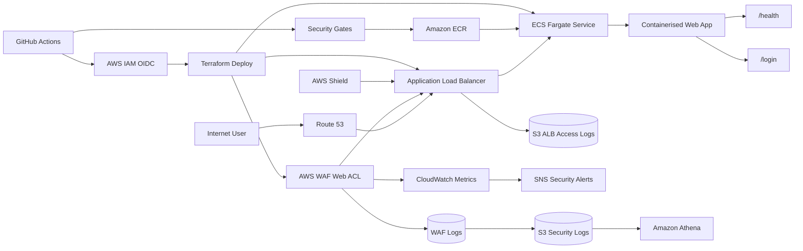
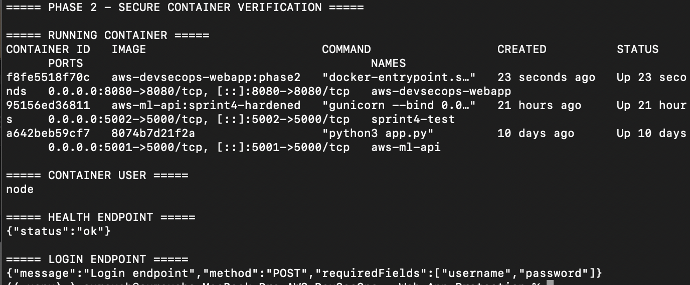

# AWSDevSecOps - Web App Protection


A hands-on DevSecOps project that deploys a containerised web application behind an AWS Application Load Balancer and progressively adds AWS WAF, logging, monitoring, DDoS protection, and automated CI/CD security gates.

The project follows a **build → destroy → automate → secure → validate** workflow to simulate how engineering teams protect internet-facing workloads from OWASP attacks, malicious bots, brute-force attempts, SQL injection, XSS, and denial-of-service attacks.

---

## Project Objectives

The goal of this project is to:

- Build a lightweight web application.
- Containerise the application securely.
- Deploy the workload manually using AWS ClickOps.
- Destroy and rebuild the infrastructure using Terraform.
- Protect the application using AWS WAF.
- Enable security logging and monitoring.
- Deploy infrastructure using GitHub Actions and AWS IAM OIDC.
- Add automated DevSecOps security gates.
- Run post-deployment security tests.
- Fail deployments when expected WAF protections are not working.

---

## Architecture



### Security Flow

```text
Internet
   |
   v
Route 53
   |
   v
AWS WAF + Shield
   |
   v
Application Load Balancer
   |
   v
ECS Fargate
   |
   v
Containerised Web Application
```

AWS WAF inspects incoming HTTP requests before traffic reaches the application.

Malicious requests are blocked before they reach the application workload.

---

## Technology Stack

| Category | Technology |
| --- | --- |
| Cloud | AWS |
| Compute | ECS Fargate |
| Container | Docker |
| Load Balancing | Application Load Balancer |
| Web Security | AWS WAF |
| DDoS Protection | AWS Shield |
| DNS | Route 53 |
| TLS | AWS Certificate Manager |
| Container Registry | Amazon ECR |
| Infrastructure as Code | Terraform |
| CI/CD | GitHub Actions |
| Container Security | Trivy |
| IaC Security | Checkov |
| SCA | npm audit / pip-audit |
| Logging | Amazon S3 |
| Monitoring | Amazon CloudWatch |
| Log Analysis | Amazon Athena |
| Alerting | Amazon SNS |
| AWS Authentication | IAM OIDC |

---

## Repository Structure

```text
aws-devsecops-webapp-protection/
├── app/
│   ├── src/
│   │   └── ...
│   ├── package.json
│   └── package-lock.json
│
├── infra/
│   ├── modules/
│   │   ├── networking/
│   │   ├── alb/
│   │   ├── ecs/
│   │   ├── waf/
│   │   ├── logging/
│   │   └── oidc/
│   │
│   ├── main.tf
│   ├── variables.tf
│   ├── outputs.tf
│   ├── providers.tf
│   └── terraform.tfvars.example
│
├── tests/
│   └── security-tests.sh
│
├── docs/
│   └── images/
│       ├── project-banner.png
│       ├── waf-rule-hit.png
│       ├── waf-blocked-request.png
│       ├── alb-access-logs.png
│       ├── waf-logs.png
│       └── cicd-security-gates.png
│
├── .github/
│   └── workflows/
│       ├── security.yml
│       └── deploy.yml
│
├── Dockerfile
├── .dockerignore
├── .gitignore
└── README.md
```

---

# Phase 1 - Application Setup

## Overview

Phase 1 establishes the local web application that will be protected and deployed throughout the AWS DevSecOps Web App Protection project.

The application is built using **Node.js and Express** and provides lightweight application and security testing endpoints.

The application exposes a dedicated health endpoint for infrastructure health checks and a controlled login endpoint that will later be used to validate AWS WAF protections against malicious web requests.

No real user accounts, credentials, or authentication data are stored or processed by the application.

---

## Phase 1 Objectives

The objectives of Phase 1 are to:

- Build a lightweight Node.js web application.
- Expose a `/health` endpoint.
- Expose a mock `/login` endpoint.
- Accept mock JSON login requests.
- Reject invalid login attempts.
- Run the application locally on port `8080`.
- Verify application behaviour before containerisation.
- Provide predictable endpoints for later AWS WAF security testing.

---

## Application Technology

The application uses:

| Component | Technology |
| --- | --- |
| Runtime | Node.js |
| Web Framework | Express |
| Application Port | `8080` |
| Request Format | JSON |
| Health Endpoint | `/health` |
| Security Test Endpoint | `/login` |

The application dependencies are defined in:

```text
app/package.json
```

The Node.js application entry point is:

```text
app/src/server.js
```

---

## Application Structure

The Phase 1 application files are organised as follows:

```text
app/
├── src/
│   └── server.js
├── package.json
└── package-lock.json
```

The `package-lock.json` file provides deterministic dependency resolution and ensures consistent dependency versions across local development and automated builds.

---

## Application Endpoints

The application exposes the following HTTP endpoints:

| Method | Endpoint | Purpose |
| --- | --- | --- |
| `GET` | `/` | Application status |
| `GET` | `/health` | Application health check |
| `GET` | `/login` | Login endpoint information |
| `POST` | `/login` | Mock login request |

These endpoints provide predictable application behaviour that can later be tested through the Application Load Balancer and AWS WAF.

---

## Root Endpoint

The root application endpoint provides basic application status information.

```text
GET /
```

Example request:

```bash
curl http://localhost:8080/
```

Expected response:

```json
{
  "application": "AWS DevSecOps Web App Protection",
  "status": "running"
}
```

---

## Health Endpoint

The application exposes a dedicated health endpoint.

```text
GET /health
```

The endpoint was tested using:

```bash
curl http://localhost:8080/health
```

Expected response:

```json
{
  "status": "ok"
}
```

The `/health` endpoint provides a lightweight method of confirming that the application process is running and responding to HTTP requests.

The endpoint will later be used by:

- Docker container verification.
- Application Load Balancer target group health checks.
- Amazon ECS Fargate service validation.
- CI/CD post-deployment application tests.

---

## Login Endpoint

The application exposes a mock login endpoint.

```text
GET /login
```

The endpoint was tested using:

```bash
curl http://localhost:8080/login
```

Expected response:

```json
{
  "message": "Login endpoint",
  "method": "POST",
  "requiredFields": [
    "username",
    "password"
  ]
}
```

The endpoint describes the expected request method and required fields for a mock login request.

The login endpoint does not authenticate real users.

It provides a controlled HTTP endpoint that will later be used to validate AWS WAF protections.

---

## Mock Login Request

The application accepts mock login requests using:

```text
POST /login
```

A test login request was performed using:

```bash
curl -i \
  -X POST \
  http://localhost:8080/login \
  -H "Content-Type: application/json" \
  -d '{"username":"admin","password":"password"}'
```

Expected HTTP response:

```text
HTTP/1.1 401 Unauthorized
```

Expected response body:

```json
{
  "status": "denied",
  "message": "Invalid username or password"
}
```

The application deliberately rejects invalid mock credentials.

No real passwords, user accounts, authentication tokens, or identity information are stored by the application.

---

## Missing Login Fields

The application validates that both `username` and `password` are included in a login request.

Example request:

```bash
curl -i \
  -X POST \
  http://localhost:8080/login \
  -H "Content-Type: application/json" \
  -d '{"username":"admin"}'
```

Expected HTTP status:

```text
HTTP/1.1 400 Bad Request
```

Expected response:

```json
{
  "status": "error",
  "message": "Username and password are required"
}
```

This provides basic request validation before later AWS WAF protections are introduced.

---

## Local Application Setup

Application dependencies were installed from the `app` directory.

```bash
cd app
npm install
```

The application was started using:

```bash
npm start
```

The Node.js start command executes:

```text
node src/server.js
```

Expected application output:

```text
Web application listening on port 8080
```

The application listens on:

```text
0.0.0.0:8080
```

Listening on `0.0.0.0` allows the application to accept network traffic when it is later executed inside a Docker container and Amazon ECS task.

---

## Local Application Verification

The application was validated locally before containerisation.

### Health Check Verification

```bash
curl http://localhost:8080/health
```

Expected:

```json
{
  "status": "ok"
}
```

### Login Endpoint Verification

```bash
curl http://localhost:8080/login
```

Expected:

```json
{
  "message": "Login endpoint",
  "method": "POST",
  "requiredFields": [
    "username",
    "password"
  ]
}
```

### Invalid Login Verification

```bash
curl -i \
  -X POST \
  http://localhost:8080/login \
  -H "Content-Type: application/json" \
  -d '{"username":"admin","password":"password"}'
```

Expected HTTP status:

```text
HTTP/1.1 401 Unauthorized
```

The following application behaviour was successfully verified:

- The Node.js application starts successfully.
- The application listens on port `8080`.
- `/health` returns `{"status":"ok"}`.
- `/login` returns the expected login endpoint information.
- `POST /login` accepts JSON request bodies.
- Invalid mock credentials return HTTP `401 Unauthorized`.
- Missing login fields return HTTP `400 Bad Request`.
- No real authentication credentials are stored or processed.

---

## Security Testing Target

The `/login` endpoint is intentionally simple and predictable.

It will later act as the application security testing target for AWS WAF.

Example malicious request patterns that will be tested include:

### SQL Injection

```text
/login?username=' OR 1=1 --
```

### Cross-Site Scripting

```text
/login?test=<script>alert(1)</script>
```

### Path Traversal and Known Bad Inputs

```text
/login?file=../../etc/passwd
```

### Excessive Requests

Repeated requests to `/login` will be used to validate AWS WAF rate-based rules.

These tests will only be performed against infrastructure owned and deployed as part of this project.

---

## Phase 1 Evidence

The following screenshot demonstrates successful local application verification.

The evidence includes:

- The Node.js application running on port `8080`.
- Successful `/health` endpoint verification.
- Successful `/login` endpoint verification.
- Invalid login credentials returning HTTP `401 Unauthorized`.


---

## Phase 1 Security Outcome

Phase 1 established the application foundation for the AWS DevSecOps Web App Protection project.

The application now:

- Runs as a lightweight Node.js and Express web service.
- Listens on port `8080`.
- Exposes a dedicated `/health` endpoint for infrastructure health checks.
- Exposes a controlled `/login` endpoint for AWS WAF security testing.
- Accepts JSON request bodies for mock login requests.
- Validates required login request fields.
- Rejects invalid mock login attempts with HTTP `401 Unauthorized`.
- Does not store or process real authentication credentials.
- Provides predictable endpoints for security validation.
- Provides a controlled target for SQL injection, XSS, known bad input, and rate-limit testing.

The application was successfully validated locally before containerisation.

**Phase 1 is complete and the application is ready for secure containerisation in Phase 2.**

---

# Phase 2 - Secure Containerisation
---

# Phase 2 - Secure Containerisation

## Overview

Phase 2 packages the Node.js web application into a Docker container and applies container security controls.

The objective is to create a lightweight and reproducible application runtime while ensuring the application does not execute as the root user.

---

## Container Security Objectives

The following container security controls were implemented:

- Lightweight Node.js Alpine base image.
- Production dependencies only.
- Deterministic dependency installation using `npm ci`.
- Non-root container execution.
- Explicit application port configuration.
- Reduced Docker build context using `.dockerignore`.
- Environment files excluded from the container build context.
- Terraform state files excluded from the container build context.

---

## Dockerfile

The application uses the following Docker configuration:

```dockerfile
FROM node:22-alpine

WORKDIR /app

COPY app/package*.json ./

RUN npm ci --omit=dev

COPY app/src ./src

ENV NODE_ENV=production
ENV PORT=8080

USER node

EXPOSE 8080

CMD ["node", "src/server.js"]
```

The `node:22-alpine` image provides a lightweight Node.js runtime.

Production dependencies are installed using:

```bash
npm ci --omit=dev
```

The container runs using the built-in non-root `node` user:

```dockerfile
USER node
```

Running the application as a non-root user reduces the impact of a potential container compromise.

---

## Docker Ignore Configuration

A `.dockerignore` file reduces unnecessary files included in the Docker build context.

```text
.git
.github
.vscode
node_modules
app/node_modules
npm-debug.log
.env
.DS_Store
docs
infra
*.tfstate
*.tfstate.*
terraform.tfvars
```

This prevents local dependencies, Git metadata, environment files, documentation, and Terraform state files from being copied into the Docker build context.

---

## Build the Docker Image

The Docker image was built from the repository root:

```bash
docker build -t aws-devsecops-webapp:phase2 .
```

Verify the image:

```bash
docker images aws-devsecops-webapp
```

Expected image:

```text
aws-devsecops-webapp   phase2
```

---

## Non-Root Container Verification

The configured container user was inspected using:

```bash
docker image inspect aws-devsecops-webapp:phase2 \
  --format 'Container user: {{.Config.User}}'
```

Expected result:

```text
Container user: node
```

This confirms that the container is configured to run using the non-root `node` user.

---

## Run the Container

The application container was started using:

```bash
docker run -d \
  --name aws-devsecops-webapp \
  -p 8080:8080 \
  aws-devsecops-webapp:phase2
```

Verify the running container:

```bash
docker ps
```

Check the application logs:

```bash
docker logs aws-devsecops-webapp
```

Expected output:

```text
Web application listening on port 8080
```

---

## Verify the Runtime User

The runtime container user was verified using:

```bash
docker exec aws-devsecops-webapp whoami
```

Expected result:

```text
node
```

This confirms that the application process is not running as the root user.

---

## Container Application Verification

The containerised application endpoints were tested locally.

### Health Endpoint

```bash
curl http://localhost:8080/health
```

Expected response:

```json
{
  "status": "ok"
}
```

### Login Endpoint

```bash
curl http://localhost:8080/login
```

Expected response:

```json
{
  "message": "Login endpoint",
  "method": "POST",
  "requiredFields": [
    "username",
    "password"
  ]
}
```

---

## Phase 2 Evidence

The following screenshot demonstrates:

- Docker container running successfully.
- Application image `aws-devsecops-webapp:phase2`.
- Container runtime user verified as `node`.
- `/health` endpoint returning `{"status":"ok"}`.
- `/login` endpoint returning the expected application response.


---

## Phase 2 Security Outcome 

Phase 2 established a secure containerised runtime for the web application.

The application now:

- Runs inside a lightweight Node.js Alpine container.
- Installs production dependencies only.
- Uses deterministic dependency installation.
- Runs as a non-root user.
- Excludes unnecessary and sensitive local files from the Docker build context.
- Successfully exposes the `/health` and `/login` endpoints from the container.

The container is now ready for deployment behind an AWS Application Load Balancer using ECS Fargate in Phase 3.

---

The following screenshot demonstrates the Docker container running successfully as the non-root `node` user and verifies the application health and login endpoints.



---

# Phase 3 - AWS ClickOps Deployment

The first AWS deployment is completed manually.

The objective is to understand the AWS resources and their relationships before automating the infrastructure.

## AWS Resources

Create the following resources manually:

- VPC.
- Public subnets.
- Internet Gateway.
- Route tables.
- Application Load Balancer.
- ALB Target Group.
- ECS Cluster.
- ECS Fargate Task Definition.
- ECS Fargate Service.
- Security Groups.
- Amazon ECR repository.
- Route 53 DNS record.
- ACM TLS certificate.

AWS WAF is **not enabled during this phase**.

## Application Request Flow

```text
Client
  |
  v
Route 53
  |
  v
Application Load Balancer
  |
  v
Target Group
  |
  v
ECS Fargate Task
  |
  v
Web Application
```

## Verification

```bash
curl https://security.example.com/health
```

Expected response:

```json
{"status":"ok"}
```

After verification, manually destroy all AWS resources.

---

# Phase 4 - Terraform Infrastructure

The AWS environment is rebuilt using Terraform.

## Terraform Resources

Terraform manages:

### Networking

- VPC.
- Public subnets.
- Internet Gateway.
- Route tables.
- Route table associations.

### Application Load Balancer

- Application Load Balancer.
- ALB Security Group.
- HTTP listener.
- HTTPS listener.
- Target Group.

### ECS

- ECS Cluster.
- ECS Task Definition.
- ECS Service.
- IAM Task Execution Role.
- CloudWatch Log Group.

### DNS and TLS

- ACM Certificate.
- ACM DNS validation.
- Route 53 record.

### CI/CD Authentication

- GitHub IAM OIDC Provider.
- GitHub Actions IAM Role.
- IAM trust policy.
- Least-privilege deployment policies.

## Terraform Deployment

```bash
cd infra

terraform init
terraform fmt -check
terraform validate
terraform plan
terraform apply
```

## Verify the Deployment

```bash
terraform output
```

```bash
curl https://security.example.com/health
```

---

# Phase 5 - AWS WAF Protection

AWS WAF protects the Application Load Balancer.

A Web ACL is associated with the ALB.

## AWS Managed Rule Groups

The following AWS managed rules are enabled:

```text
AWSManagedRulesCommonRuleSet
AWSManagedRulesKnownBadInputsRuleSet
AWSManagedRulesSQLiRuleSet
```

Optional:

```text
AWSManagedRulesBotControlRuleSet
```

## Custom WAF Rules

### Missing User-Agent Rule

Requests without a `User-Agent` header are blocked.

```bash
curl -H "User-Agent:" \
  https://security.example.com/health
```

Expected:

```text
HTTP 403 Forbidden
```

### IP Rate Limiting

A rate-based rule limits excessive requests from a single source IP.

```bash
for i in $(seq 1 200); do
  curl -s -o /dev/null \
    -w "%{http_code}\n" \
    https://security.example.com/login
done
```

Requests should eventually return:

```text
403
```

### Geo Restriction

Requests from selected countries are blocked for demonstration purposes.

```hcl
blocked_country_codes = [
  "XX",
  "YY"
]
```

Country codes should be configured using Terraform variables.

---

# WAF Security Testing

## SQL Injection Test

```bash
curl -i \
  "https://security.example.com/login?username=%27%20OR%201%3D1%20--"
```

Expected response:

```text
HTTP/2 403
```

## XSS Test

```bash
curl -i \
  "https://security.example.com/login?test=%3Cscript%3Ealert%281%29%3C%2Fscript%3E"
```

Expected response:

```text
HTTP/2 403
```

## Known Bad Input Test

```bash
curl -i \
  "https://security.example.com/login?file=../../etc/passwd"
```

Expected response:

```text
HTTP/2 403
```

---

# WAF Rule Evidence

## WAF Rule Hit


The screenshot demonstrates an AWS WAF rule matching a malicious request.

## Blocked Request


The blocked request should display the matching rule and terminating `BLOCK` action.

---

# Phase 6 - Logging and Monitoring

Security telemetry is enabled for the Application Load Balancer and AWS WAF.

## WAF Logging

Captured information includes:

- Request timestamp.
- Source IP address.
- HTTP method.
- URI.
- Request headers.
- Matching WAF rule.
- Web ACL action.
- Rate-based rule information.

## WAF Log Evidence


Sensitive fields should be redacted where appropriate.

---

## ALB Access Logs

Application Load Balancer access logging is enabled.

Logs are delivered to an S3 bucket.

## ALB Log Evidence


ALB logs provide visibility into:

- Client requests.
- HTTP response codes.
- Target response codes.
- Request processing times.
- User agents.
- Requested URLs.

---

## CloudWatch Metrics

Important AWS WAF metrics include:

```text
AllowedRequests
BlockedRequests
CountedRequests
```

Metrics can be reviewed for the Web ACL and individual rules.

---

## AWS Shield

AWS Shield Standard provides baseline DDoS protection for supported AWS services.

AWS Shield Advanced can optionally be evaluated for environments requiring additional DDoS visibility and response capabilities.

Shield Advanced is optional due to additional cost considerations.

---

# Athena WAF Log Analysis

Amazon Athena can query security logs stored in Amazon S3.

Example security questions include:

- Which IP addresses generate the most blocked requests?
- Which WAF rules trigger most frequently?
- Which URIs receive malicious traffic?
- Which countries generate blocked traffic?
- What attack patterns occur most frequently?

Example query:

```sql
SELECT
    terminatingruleid,
    COUNT(*) AS blocked_requests
FROM waf_logs
WHERE action = 'BLOCK'
GROUP BY terminatingruleid
ORDER BY blocked_requests DESC;
```

---

# SNS Security Alerts

CloudWatch alarms can trigger Amazon SNS notifications.

Example alert conditions include:

- High number of blocked requests.
- Rate-limit rule triggered.
- Sudden SQL injection attempts.
- Significant increase in malicious traffic.

```text
AWS WAF
   |
   v
CloudWatch Metric
   |
   v
CloudWatch Alarm
   |
   v
Amazon SNS
   |
   v
Security Notification
```

---

# Phase 7 - CI/CD Security Gates

GitHub Actions provides the DevSecOps deployment pipeline.

```text
Security Scans
      |
      v
Container Build
      |
      v
Terraform Deploy
      |
      v
Post-Deploy Security Tests
```

A security failure stops the deployment pipeline.

---

## Stage 1 - Static Security Scans

### Trivy

Trivy scans the container image for vulnerabilities.

```bash
trivy image \
  --exit-code 1 \
  --severity HIGH,CRITICAL \
  webapp:latest
```

The pipeline fails when prohibited vulnerabilities are detected.

### Checkov

Checkov scans Terraform infrastructure.

```bash
checkov -d infra/
```

Checks include:

- Public resource exposure.
- Encryption configuration.
- IAM permissions.
- Logging configuration.
- Network security.
- AWS security best practices.

### Software Composition Analysis

Node.js:

```bash
npm audit
```

Python:

```bash
pip-audit
```

The selected scanner depends on the application runtime.

---

# Stage 2 - Build and Push

The container image is built after the security gates pass.

```text
Source Code
    |
    v
Docker Build
    |
    v
Trivy Scan
    |
    v
Amazon ECR
```

Images are tagged using the Git commit SHA.

Example:

```text
webapp:a1b2c3d
```

Immutable image tags improve deployment traceability.

---

# Stage 3 - Terraform Deployment

GitHub Actions authenticates with AWS using IAM OIDC.

Static AWS access keys are not stored in GitHub Secrets.

## Authentication Flow

```text
GitHub Actions
      |
      v
GitHub OIDC Token
      |
      v
AWS IAM Trust Policy
      |
      v
Assume IAM Role
      |
      v
Temporary AWS Credentials
```

The pipeline executes:

```bash
terraform init
terraform fmt -check
terraform validate
terraform plan
terraform apply -auto-approve
```

---

# Stage 4 - Post-Deployment Security Tests

Automated security tests verify that AWS WAF actively blocks malicious requests.

## XSS Test

```bash
curl -s -o /dev/null \
  -w "%{http_code}" \
  "https://security.example.com/login?test=%3Cscript%3Ealert%281%29%3C%2Fscript%3E"
```

Expected:

```text
403
```

## SQL Injection Test

```bash
curl -s -o /dev/null \
  -w "%{http_code}" \
  "https://security.example.com/login?username=%27%20OR%201%3D1%20--"
```

Expected:

```text
403
```

## Pipeline Failure Logic

```bash
STATUS_CODE=$(curl -s -o /dev/null \
  -w "%{http_code}" \
  "https://security.example.com/login?test=%3Cscript%3Ealert%281%29%3C%2Fscript%3E")

if [ "$STATUS_CODE" = "200" ]; then
  echo "Security test failed: malicious request was allowed"
  exit 1
fi

echo "Security test passed: request blocked with HTTP $STATUS_CODE"
```

If AWS WAF allows the malicious request, the pipeline fails.

---

# CI/CD Security Evidence


Evidence should demonstrate:

- Trivy scan passing.
- Checkov scan passing.
- Dependency scan passing.
- Container image pushed to ECR.
- Terraform deployment succeeding.
- Post-deployment WAF tests returning HTTP `403`.

---

# Security Controls Implemented

| Threat | Security Control |
| --- | --- |
| SQL Injection | AWS Managed SQLi Rules |
| Cross-Site Scripting | AWS Common Rule Set |
| Known Malicious Inputs | Known Bad Inputs Rules |
| Automated Bots | AWS Bot Control |
| Brute Force | WAF Rate-Based Rules |
| Request Flooding | WAF Rate Limiting |
| DDoS | AWS Shield |
| Geographic Restrictions | WAF Geo Match |
| Anonymous Scripts | User-Agent Validation |
| Vulnerable Containers | Trivy |
| Insecure Terraform | Checkov |
| Vulnerable Dependencies | SCA |
| Static AWS Credentials | IAM OIDC |
| Security Regression | Post-Deploy WAF Tests |
| Traffic Investigation | ALB and WAF Logs |

---

# Security Design Decisions

## WAF Before the Application

Malicious traffic is blocked before reaching ECS tasks.

This reduces unnecessary application processing and limits exposure of the application runtime.

## No Static AWS Credentials

GitHub Actions uses AWS IAM OIDC and short-lived credentials.

Long-lived AWS access keys are not stored in the CI/CD platform.

## Immutable Container Tags

Container images use Git commit SHA tags.

This creates a direct relationship between source code and deployed artifacts.

## Security Gates Before Deployment

Security scans execute before infrastructure deployment.

A failed security control prevents the pipeline from progressing.

## Security Validation After Deployment

Successful infrastructure deployment does not automatically mean the security configuration is correct.

Post-deployment tests verify that AWS WAF actively blocks malicious request patterns.

---

# Threat Model

The project focuses on internet-originated threats against a public web application.

## Protected Assets

- Web application.
- ECS workloads.
- Application endpoints.
- AWS infrastructure.
- Deployment pipeline.
- Security logs.

## Threat Actors

- Automated scanners.
- Malicious bots.
- Opportunistic attackers.
- Brute-force tools.
- Web vulnerability scanners.

## Example Threats

```text
SQL Injection
Cross-Site Scripting
Path Traversal
Known Malicious Inputs
Bot Traffic
Brute Force
HTTP Request Flooding
DDoS
CI/CD Credential Exposure
Infrastructure Misconfiguration
```

---

# Verification Checklist

## Application

- [ ] `/health` returns HTTP 200.
- [ ] `/login` is reachable.
- [ ] Application listens on the configured port.

## Container

- [ ] Multi-stage build implemented.
- [ ] Container runs as non-root.
- [ ] Minimal runtime image used.
- [ ] Health check configured.
- [ ] Container scan passes.

## AWS Infrastructure

- [ ] VPC deployed.
- [ ] ALB deployed.
- [ ] ECS Fargate service healthy.
- [ ] HTTPS enabled.
- [ ] Route 53 record configured.
- [ ] ACM certificate validated.

## AWS WAF

- [ ] Web ACL associated with ALB.
- [ ] Common Rule Set enabled.
- [ ] Known Bad Inputs enabled.
- [ ] SQLi Rule Set enabled.
- [ ] Missing User-Agent rule enabled.
- [ ] Rate limiting enabled.
- [ ] Geo restriction enabled.

## Logging

- [ ] WAF logging enabled.
- [ ] ALB access logging enabled.
- [ ] CloudWatch metrics enabled.
- [ ] Security logs stored centrally.

## CI/CD

- [ ] Trivy scan configured.
- [ ] Checkov scan configured.
- [ ] Dependency scan configured.
- [ ] AWS OIDC authentication configured.
- [ ] Container pushed to ECR.
- [ ] Terraform deployment automated.
- [ ] Post-deployment security tests configured.

---

# Screenshots and Project Evidence

| Evidence | Image |
| --- | --- |
| AWS WAF rule hit | `docs/images/waf-rule-hit.png` |
| Blocked malicious request | `docs/images/waf-blocked-request.png` |
| ALB access logs | `docs/images/alb-access-logs.png` |
| AWS WAF logs | `docs/images/waf-logs.png` |
| CI/CD security gates | `docs/images/cicd-security-gates.png` |

> Screenshots must not expose AWS account IDs, credentials, tokens, or other sensitive values.

---

# Cost Considerations

This project deploys billable AWS resources.

Potential costs include:

- Application Load Balancer.
- ECS Fargate tasks.
- NAT Gateway if added.
- AWS WAF Web ACL and rule evaluations.
- AWS WAF Bot Control.
- S3 log storage.
- CloudWatch logs and metrics.
- Route 53 hosted zones.
- Athena queries.
- AWS Shield Advanced if enabled.

Destroy resources when testing is complete.

```bash
cd infra
terraform destroy
```

Review the AWS account after destruction to confirm billable resources have been removed.

---

# Key Learning Outcomes

By completing this project, you will demonstrate practical experience with:

- AWS application security.
- AWS WAF architecture.
- OWASP web attack mitigation.
- Container security.
- ECS Fargate.
- Application Load Balancers.
- Infrastructure as Code.
- Terraform.
- GitHub Actions.
- AWS IAM OIDC.
- DevSecOps security gates.
- Container vulnerability scanning.
- IaC security scanning.
- Security logging.
- Cloud security monitoring.
- Automated security validation.

---

# Future Improvements

Potential improvements include:

- AWS Firewall Manager.
- AWS Security Hub integration.
- Amazon GuardDuty.
- AWS Config rules.
- Security Lake integration.
- SIEM log forwarding.
- Automated IP reputation lists.
- WAF CAPTCHA challenges.
- WAF Challenge actions.
- Custom bot detection.
- Canary security testing.
- OWASP ZAP integration.
- Signed container images.
- SBOM generation.
- SLSA build provenance.
- Terraform policy enforcement using OPA or Conftest.

---

# Disclaimer

This project is designed for educational and authorised security testing purposes.

Security tests should only be executed against infrastructure that you own or have explicit permission to test.

The WAF rules and security thresholds used in this project are demonstration configurations and should be reviewed, tuned, and tested before use in production environments.

---

## Project Status

```text
Application             [ ]
Secure Container        [ ]
ClickOps Deployment     [ ]
Terraform Deployment    [ ]
AWS WAF                 [ ]
Security Logging        [ ]
CI/CD Security Gates    [ ]
Post-Deploy Testing     [ ]
Documentation           [ ]
```

---

**Repository:** `aws-devsecops-webapp-protection`
