# AWSDevSecOps - Web App Protection

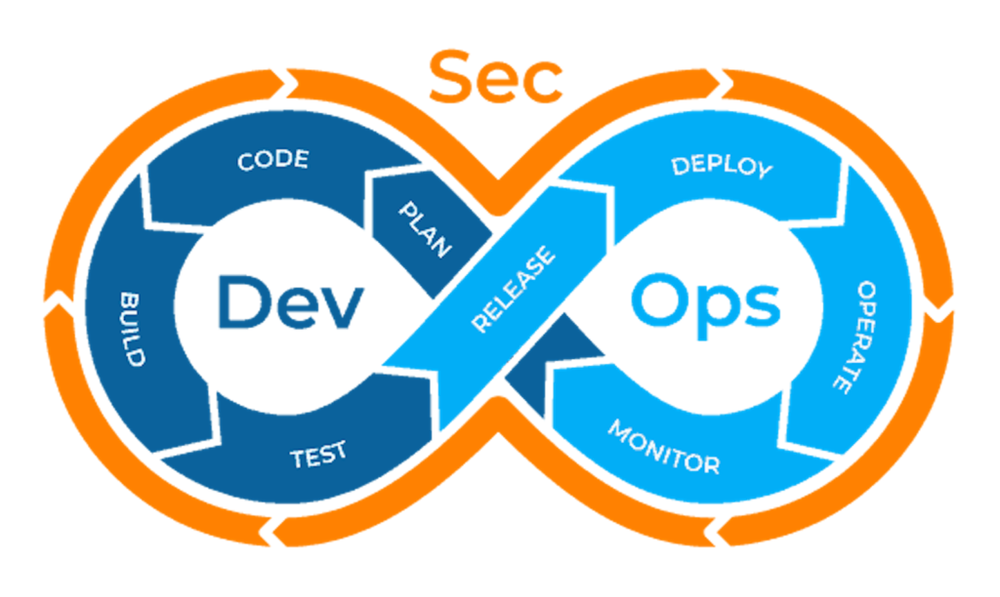

A hands-on DevSecOps project that deploys a containerised web application behind an AWS Application Load Balancer and progressively adds AWS WAF, logging, monitoring, DDoS protection, and automated CI/CD security gates.

The project follows a **build → destroy → automate → secure → validate** workflow to simulate how engineering teams protect internet-facing workloads from OWASP attacks, malicious bots, brute-force attempts, SQL injection, XSS, and denial-of-service attacks.

---

## Project Objectives

The goal of this project is to:

- Build a lightweight web application.
- Containerise the application securely.
- Deploy the workload manually using AWS ClickOps.
- Destroy and rebuild the infrastructure using Terraform.
- Protect the application using AWS WAF.
- Enable security logging and monitoring.
- Deploy infrastructure using GitHub Actions and AWS IAM OIDC.
- Add automated DevSecOps security gates.
- Run post-deployment security tests.
- Fail deployments when expected WAF protections are not working.

---

## Architecture

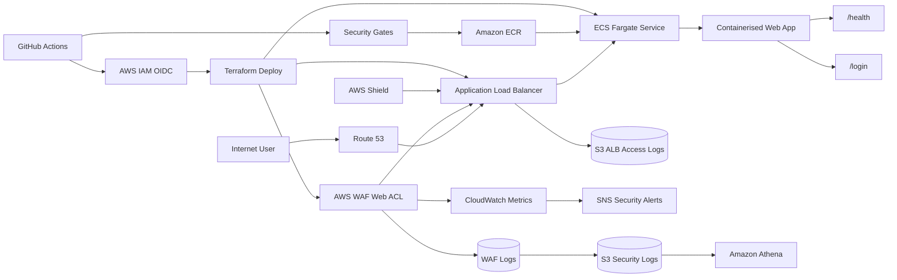

### Security Flow

```text
Internet
   |
   v
Route 53
   |
   v
AWS WAF + Shield
   |
   v
Application Load Balancer
   |
   v
ECS Fargate
   |
   v
Containerised Web Application
```

AWS WAF inspects incoming HTTP requests before traffic reaches the application.

Malicious requests are blocked before they reach the application workload.

---

## Technology Stack

| Category | Technology |
| --- | --- |
| Cloud | AWS |
| Compute | ECS Fargate |
| Container | Docker |
| Load Balancing | Application Load Balancer |
| Web Security | AWS WAF |
| DDoS Protection | AWS Shield |
| DNS | Route 53 |
| TLS | AWS Certificate Manager |
| Container Registry | Amazon ECR |
| Infrastructure as Code | Terraform |
| CI/CD | GitHub Actions |
| Container Security | Trivy |
| IaC Security | Checkov |
| SCA | npm audit / pip-audit |
| Logging | Amazon S3 |
| Monitoring | Amazon CloudWatch |
| Log Analysis | Amazon Athena |
| Alerting | Amazon SNS |
| AWS Authentication | IAM OIDC |

---

## Repository Structure

```text
aws-devsecops-webapp-protection/
├── app/
│   ├── src/
│   │   └── ...
│   ├── package.json
│   └── package-lock.json
│
├── infra/
│   ├── modules/
│   │   ├── networking/
│   │   ├── alb/
│   │   ├── ecs/
│   │   ├── waf/
│   │   ├── logging/
│   │   └── oidc/
│   │
│   ├── main.tf
│   ├── variables.tf
│   ├── outputs.tf
│   ├── providers.tf
│   └── terraform.tfvars.example
│
├── tests/
│   └── security-tests.sh
│
├── docs/
│   └── images/
│       ├── project-banner.png
│       ├── waf-rule-hit.png
│       ├── waf-blocked-request.png
│       ├── alb-access-logs.png
│       ├── waf-logs.png
│       └── cicd-security-gates.png
│
├── .github/
│   └── workflows/
│       ├── security.yml
│       └── deploy.yml
│
├── Dockerfile
├── .dockerignore
├── .gitignore
└── README.md
```

---

# Phase 1 - Application Setup

## Overview

Phase 1 establishes the local web application that will be protected and deployed throughout the AWS DevSecOps Web App Protection project.

The application is built using **Node.js and Express** and provides lightweight application and security testing endpoints.

The application exposes a dedicated health endpoint for infrastructure health checks and a controlled login endpoint that will later be used to validate AWS WAF protections against malicious web requests.

No real user accounts, credentials, or authentication data are stored or processed by the application.

---

## Phase 1 Objectives

The objectives of Phase 1 are to:

- Build a lightweight Node.js web application.
- Expose a `/health` endpoint.
- Expose a mock `/login` endpoint.
- Accept mock JSON login requests.
- Reject invalid login attempts.
- Run the application locally on port `8080`.
- Verify application behaviour before containerisation.
- Provide predictable endpoints for later AWS WAF security testing.

---

## Application Technology

The application uses:

| Component | Technology |
| --- | --- |
| Runtime | Node.js |
| Web Framework | Express |
| Application Port | `8080` |
| Request Format | JSON |
| Health Endpoint | `/health` |
| Security Test Endpoint | `/login` |

The application dependencies are defined in:

```text
app/package.json
```

The Node.js application entry point is:

```text
app/src/server.js
```

---

## Application Structure

The Phase 1 application files are organised as follows:

```text
app/
├── src/
│   └── server.js
├── package.json
└── package-lock.json
```

The `package-lock.json` file provides deterministic dependency resolution and ensures consistent dependency versions across local development and automated builds.

---

## Application Endpoints

The application exposes the following HTTP endpoints:

| Method | Endpoint | Purpose |
| --- | --- | --- |
| `GET` | `/` | Application status |
| `GET` | `/health` | Application health check |
| `GET` | `/login` | Login endpoint information |
| `POST` | `/login` | Mock login request |

These endpoints provide predictable application behaviour that can later be tested through the Application Load Balancer and AWS WAF.

---

## Root Endpoint

The root application endpoint provides basic application status information.

```text
GET /
```

Example request:

```bash
curl http://localhost:8080/
```

Expected response:

```json
{
  "application": "AWS DevSecOps Web App Protection",
  "status": "running"
}
```

---

## Health Endpoint

The application exposes a dedicated health endpoint.

```text
GET /health
```

The endpoint was tested using:

```bash
curl http://localhost:8080/health
```

Expected response:

```json
{
  "status": "ok"
}
```

The `/health` endpoint provides a lightweight method of confirming that the application process is running and responding to HTTP requests.

The endpoint will later be used by:

- Docker container verification.
- Application Load Balancer target group health checks.
- Amazon ECS Fargate service validation.
- CI/CD post-deployment application tests.

---

## Login Endpoint

The application exposes a mock login endpoint.

```text
GET /login
```

The endpoint was tested using:

```bash
curl http://localhost:8080/login
```

Expected response:

```json
{
  "message": "Login endpoint",
  "method": "POST",
  "requiredFields": [
    "username",
    "password"
  ]
}
```

The endpoint describes the expected request method and required fields for a mock login request.

The login endpoint does not authenticate real users.

It provides a controlled HTTP endpoint that will later be used to validate AWS WAF protections.

---

## Mock Login Request

The application accepts mock login requests using:

```text
POST /login
```

A test login request was performed using:

```bash
curl -i \
  -X POST \
  http://localhost:8080/login \
  -H "Content-Type: application/json" \
  -d '{"username":"admin","password":"password"}'
```

Expected HTTP response:

```text
HTTP/1.1 401 Unauthorized
```

Expected response body:

```json
{
  "status": "denied",
  "message": "Invalid username or password"
}
```

The application deliberately rejects invalid mock credentials.

No real passwords, user accounts, authentication tokens, or identity information are stored by the application.

---

## Missing Login Fields

The application validates that both `username` and `password` are included in a login request.

Example request:

```bash
curl -i \
  -X POST \
  http://localhost:8080/login \
  -H "Content-Type: application/json" \
  -d '{"username":"admin"}'
```

Expected HTTP status:

```text
HTTP/1.1 400 Bad Request
```

Expected response:

```json
{
  "status": "error",
  "message": "Username and password are required"
}
```

This provides basic request validation before later AWS WAF protections are introduced.

---

## Local Application Setup

Application dependencies were installed from the `app` directory.

```bash
cd app
npm install
```

The application was started using:

```bash
npm start
```

The Node.js start command executes:

```text
node src/server.js
```

Expected application output:

```text
Web application listening on port 8080
```

The application listens on:

```text
0.0.0.0:8080
```

Listening on `0.0.0.0` allows the application to accept network traffic when it is later executed inside a Docker container and Amazon ECS task.

---

## Local Application Verification

The application was validated locally before containerisation.

### Health Check Verification

```bash
curl http://localhost:8080/health
```

Expected:

```json
{
  "status": "ok"
}
```

### Login Endpoint Verification

```bash
curl http://localhost:8080/login
```

Expected:

```json
{
  "message": "Login endpoint",
  "method": "POST",
  "requiredFields": [
    "username",
    "password"
  ]
}
```

### Invalid Login Verification

```bash
curl -i \
  -X POST \
  http://localhost:8080/login \
  -H "Content-Type: application/json" \
  -d '{"username":"admin","password":"password"}'
```

Expected HTTP status:

```text
HTTP/1.1 401 Unauthorized
```

The following application behaviour was successfully verified:

- The Node.js application starts successfully.
- The application listens on port `8080`.
- `/health` returns `{"status":"ok"}`.
- `/login` returns the expected login endpoint information.
- `POST /login` accepts JSON request bodies.
- Invalid mock credentials return HTTP `401 Unauthorized`.
- Missing login fields return HTTP `400 Bad Request`.
- No real authentication credentials are stored or processed.

---

## Security Testing Target

The `/login` endpoint is intentionally simple and predictable.

It will later act as the application security testing target for AWS WAF.

Example malicious request patterns that will be tested include:

### SQL Injection

```text
/login?username=' OR 1=1 --
```

### Cross-Site Scripting

```text
/login?test=<script>alert(1)</script>
```

### Path Traversal and Known Bad Inputs

```text
/login?file=../../etc/passwd
```

### Excessive Requests

Repeated requests to `/login` will be used to validate AWS WAF rate-based rules.

These tests will only be performed against infrastructure owned and deployed as part of this project.

---

## Phase 1 Evidence

The following screenshot demonstrates successful local application verification.

The evidence includes:

- The Node.js application running on port `8080`.
- Successful `/health` endpoint verification.
- Successful `/login` endpoint verification.
- Invalid login credentials returning HTTP `401 Unauthorized`.

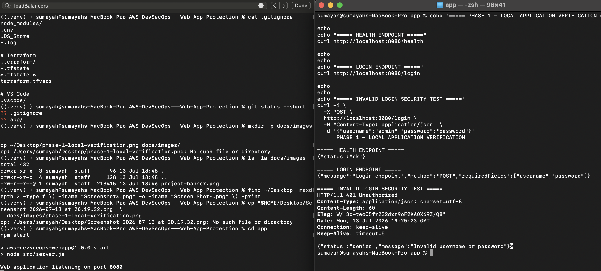

---

## Phase 1 Security Outcome

Phase 1 established the application foundation and a controlled security testing target for the AWS DevSecOps Web App Protection project.

The application now:

- Runs as a lightweight Node.js and Express web service.
- Listens on port `8080`.
- Exposes a dedicated `/health` endpoint for application and infrastructure health checks.
- Exposes a controlled `/login` endpoint for AWS WAF security testing.
- Accepts JSON request bodies for mock login requests.
- Validates required login request fields.
- Rejects invalid mock login attempts with HTTP `401 Unauthorized`.
- Rejects incomplete login requests with HTTP `400 Bad Request`.
- Does not store or process real authentication credentials.
- Does not expose the Express `X-Powered-By` response header.
- Provides predictable endpoints for repeatable security validation.
- Provides a controlled target for SQL injection, XSS, known bad input, and rate-limit testing in later phases.

The application was successfully validated locally before containerisation.

### Phase 1 Security Validation

A local security verification test was performed against the running application on port `8080`.

The following controls and application behaviours were verified:

| Security Check | Expected Result | Verified Result |
| --- | --- | --- |
| Health endpoint | HTTP `200 OK` | Passed |
| Login endpoint availability | HTTP `200 OK` | Passed |
| Invalid login attempt | HTTP `401 Unauthorized` | Passed |
| Missing required password field | HTTP `400 Bad Request` | Passed |
| Express header disclosure | `X-Powered-By` header not exposed | Passed |

The invalid login test confirms that mock authentication failures are rejected with a controlled `401 Unauthorized` response.

The missing-password test confirms that malformed or incomplete login requests are rejected with a `400 Bad Request` response before further processing.

The Express header disclosure check confirms that the `X-Powered-By` response header is not exposed, reducing unnecessary framework information disclosure.

These tests establish the expected baseline application behaviour before container security controls and AWS WAF protections are introduced.

### Phase 1 Security Outcome Evidence

The following terminal evidence demonstrates the completed Phase 1 security verification.

The evidence confirms:

- The `/health` endpoint returns HTTP `200 OK`.
- The `/login` endpoint is available and returns HTTP `200 OK`.
- Invalid login attempts return HTTP `401 Unauthorized`.
- Requests with a missing password return HTTP `400 Bad Request`.
- The Express `X-Powered-By` response header is not exposed.
- The Phase 1 security verification completed successfully.

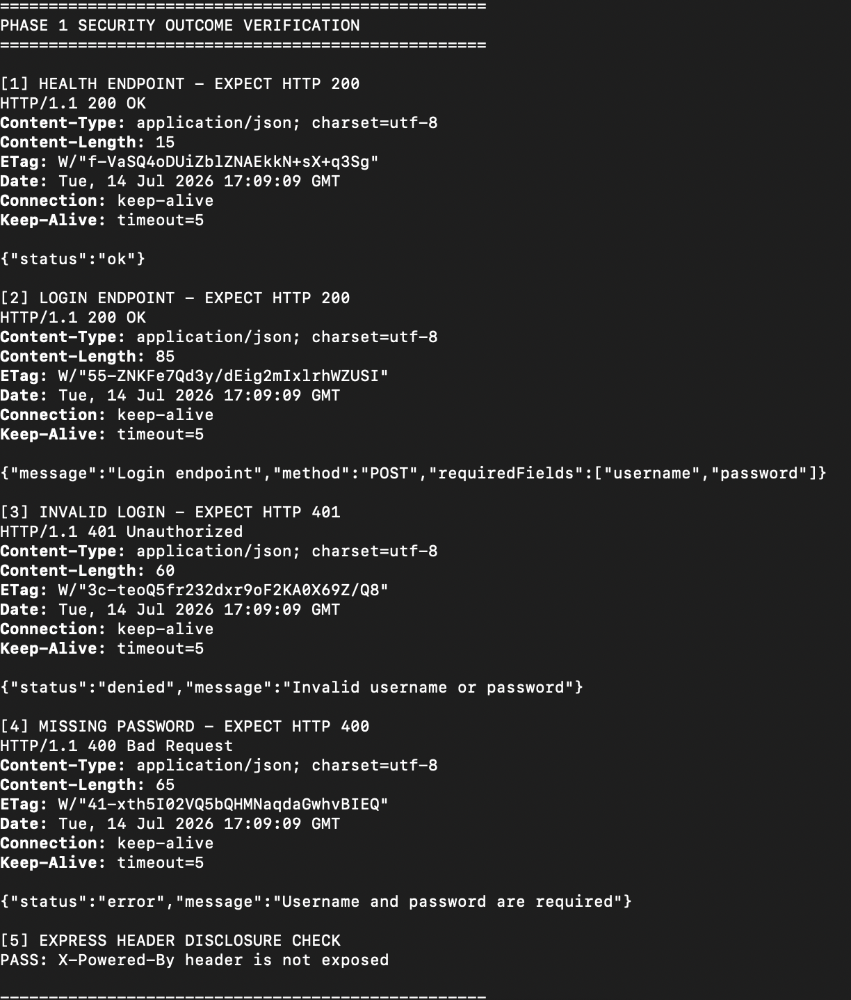

**Evidence file:** `docs/images/phase-1-security-outcome-verification.png`

### Phase 1 Security Outcome Summary

Phase 1 delivered a locally validated Node.js and Express application with predictable endpoints and controlled error handling suitable for DevSecOps security testing.

The application provides a repeatable baseline for later security phases, including container hardening, AWS infrastructure deployment, AWS WAF managed rule validation, SQL injection testing, cross-site scripting testing, known bad input testing, and rate-based protection.

Phase 1 security verification confirms that the application is functioning as expected and is ready for secure containerisation in Phase 2.

**Phase 1 is complete and the application is ready for secure containerisation in Phase 2.**

---


# Phase 2 - Secure Containerisation

## Overview

Phase 2 packages the Node.js web application into a Docker container and applies container security controls.

The objective is to create a lightweight and reproducible application runtime while ensuring the application does not execute as the root user.

---

## Container Security Objectives

The following container security controls were implemented:

- Lightweight Node.js Alpine base image.
- Production dependencies only.
- Deterministic dependency installation using `npm ci`.
- Non-root container execution.
- Explicit application port configuration.
- Reduced Docker build context using `.dockerignore`.
- Environment files excluded from the container build context.
- Terraform state files excluded from the container build context.

---

## Dockerfile

The application uses the following Docker configuration:

```dockerfile
FROM node:22-alpine

WORKDIR /app

COPY app/package*.json ./

RUN npm ci --omit=dev

COPY app/src ./src

ENV NODE_ENV=production
ENV PORT=8080

USER node

EXPOSE 8080

CMD ["node", "src/server.js"]
```

The `node:22-alpine` image provides a lightweight Node.js runtime.

Production dependencies are installed using:

```bash
npm ci --omit=dev
```

The container runs using the built-in non-root `node` user:

```dockerfile
USER node
```

Running the application as a non-root user reduces the impact of a potential container compromise.

---

## Docker Ignore Configuration

A `.dockerignore` file reduces unnecessary files included in the Docker build context.

```text
.git
.github
.vscode
node_modules
app/node_modules
npm-debug.log
.env
.DS_Store
docs
infra
*.tfstate
*.tfstate.*
terraform.tfvars
```

This prevents local dependencies, Git metadata, environment files, documentation, and Terraform state files from being copied into the Docker build context.

---

## Build the Docker Image

The Docker image was built from the repository root:

```bash
docker build -t aws-devsecops-webapp:phase2 .
```

Verify the image:

```bash
docker images aws-devsecops-webapp
```

Expected image:

```text
aws-devsecops-webapp   phase2
```

---

## Non-Root Container Verification

The configured container user was inspected using:

```bash
docker image inspect aws-devsecops-webapp:phase2 \
  --format 'Container user: {{.Config.User}}'
```

Expected result:

```text
Container user: node
```

This confirms that the container is configured to run using the non-root `node` user.

---

## Run the Container

The application container was started using:

```bash
docker run -d \
  --name aws-devsecops-webapp \
  -p 8080:8080 \
  aws-devsecops-webapp:phase2
```

Verify the running container:

```bash
docker ps
```

Check the application logs:

```bash
docker logs aws-devsecops-webapp
```

Expected output:

```text
Web application listening on port 8080
```

---

## Verify the Runtime User

The runtime container user was verified using:

```bash
docker exec aws-devsecops-webapp whoami
```

Expected result:

```text
node
```

This confirms that the application process is not running as the root user.

---

## Container Application Verification

The containerised application endpoints were tested locally.

### Health Endpoint

```bash
curl http://localhost:8080/health
```

Expected response:

```json
{
  "status": "ok"
}
```

### Login Endpoint

```bash
curl http://localhost:8080/login
```

Expected response:

```json
{
  "message": "Login endpoint",
  "method": "POST",
  "requiredFields": [
    "username",
    "password"
  ]
}
```

---

## Phase 2 Security Outcome

Phase 2 established a secure containerised runtime for the web application and introduced container-level security controls before deployment to AWS.

The application now:

- Runs inside a lightweight Node.js Alpine container.
- Installs production dependencies only using `npm ci --omit=dev`.
- Uses deterministic dependency installation based on the committed `package-lock.json`.
- Runs as the non-root `node` user.
- Executes at runtime with a non-root UID.
- Excludes unnecessary and sensitive local files from the Docker build context using `.dockerignore`.
- Exposes application port `8080`.
- Successfully serves the `/health` and `/login` endpoints from the running container.
- Does not expose the Express `X-Powered-By` response header.
- Provides a secure container baseline for deployment to AWS infrastructure.

The container was successfully built, started, and security-validated locally before deployment to AWS.

### Phase 2 Security Validation

Security verification was performed against the running Docker container to confirm both the container runtime configuration and application functionality after containerisation.

The verification confirmed:

- The Docker container is running successfully.
- The application is running from the `aws-devsecops-webapp:phase2` image.
- Container port `8080` is published to host port `8080`.
- The container image is configured to run as the non-root `node` user.
- The running application process executes with UID `1000`.
- The runtime UID is not privileged root UID `0`.
- The `/health` endpoint returns HTTP `200 OK` with `{"status":"ok"}`.
- The `/login` endpoint returns HTTP `200 OK` with the expected application response.
- The Express `X-Powered-By` response header is not exposed.
- The Phase 2 secure containerisation verification completed successfully.

### Verified Security Controls

| Security Check | Expected Result | Verified Result |
| --- | --- | --- |
| Container status | Container running | Passed |
| Container image | `aws-devsecops-webapp:phase2` | Passed |
| Container port | Port `8080` published | Passed |
| Configured container user | Non-root `node` user | Passed |
| Runtime identity | UID must not be `0` | Passed — UID `1000` |
| Health endpoint | HTTP `200 OK` | Passed |
| Login endpoint | HTTP `200 OK` | Passed |
| Express header disclosure | `X-Powered-By` header not exposed | Passed |

### Phase 2 Security Outcome Evidence

The following terminal evidence confirms the secure container runtime configuration and validates application functionality from the running Docker container.

The evidence demonstrates:

- The `aws-devsecops-webapp:phase2` container image is running successfully.
- The container is configured to run as the non-root `node` user.
- Runtime identity verification confirms UID `1000`.
- The application process is not running as privileged root UID `0`.
- The `/health` endpoint returns HTTP `200 OK`.
- The `/login` endpoint returns HTTP `200 OK`.
- The Express `X-Powered-By` response header is not exposed.
- Phase 2 secure containerisation verification completed successfully.

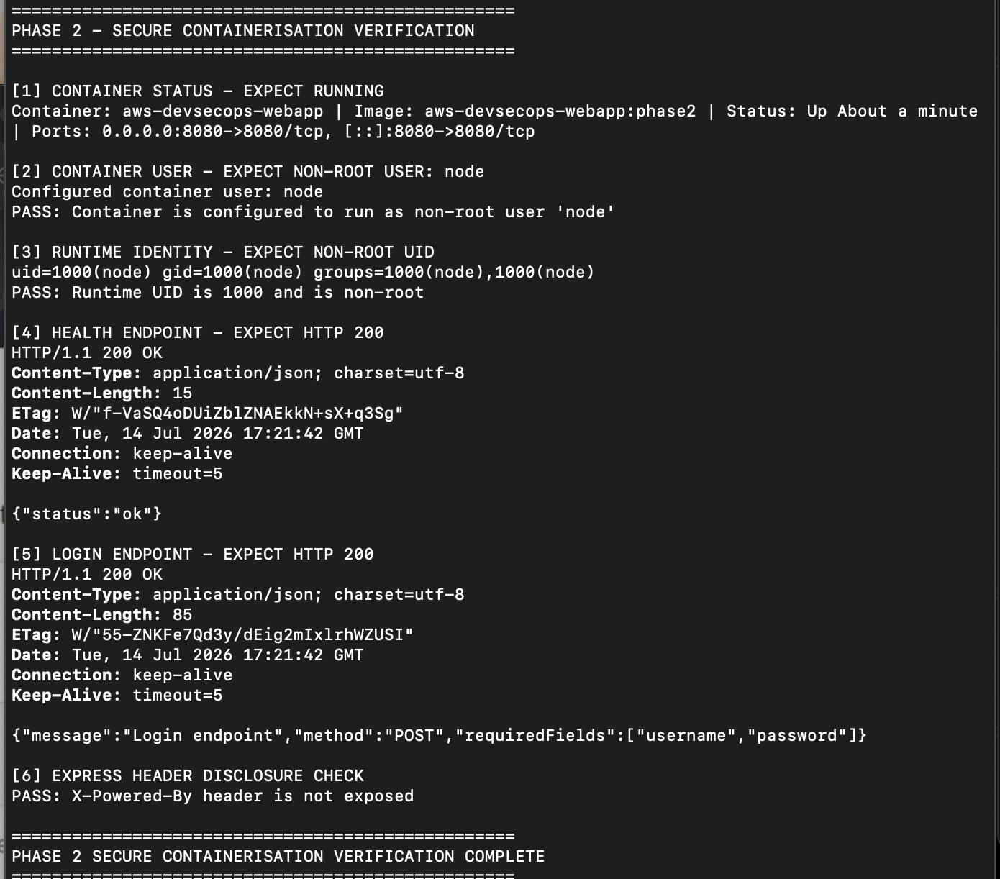

**Evidence file:** `docs/images/phase-2-security-outcome-verification.png`

### Phase 2 Security Outcome Summary

Phase 2 successfully containerised the Node.js and Express application and established a secure container runtime baseline.

The Docker image uses a lightweight Node.js Alpine base image and installs production dependencies only using deterministic dependency installation.

The container is explicitly configured to run as the non-root `node` user. Runtime identity verification confirms that the application process executes with UID `1000` rather than privileged root UID `0`.

Running the application as a non-root user applies the principle of least privilege and reduces the potential impact of an application or container compromise.

The `.dockerignore` configuration reduces the Docker build context and prevents unnecessary local development files, dependency directories, Terraform state files, and environment files from being copied into the image build context.

Application health and login endpoints remain accessible through published port `8080`, confirming that the container security controls do not prevent the application from functioning as expected.

The Express `X-Powered-By` response header also remains disabled, reducing unnecessary framework information disclosure.

Phase 2 establishes the secure container baseline required for deployment behind an AWS Application Load Balancer using Amazon ECS on AWS Fargate in Phase 3.

---

# Phase 3 - Secure Container Registry with Amazon ECR

## Overview

Phase 3 establishes a secure AWS-managed container image registry using Amazon Elastic Container Registry (Amazon ECR).

The objective of this phase is to move the securely containerised application produced and validated during Phase 2 into a private AWS container registry before deploying the application to the AWS runtime environment.

The verified Phase 2 container image is authenticated, tagged, published, scanned, and verified in Amazon ECR.

This creates a controlled container image supply path for the Amazon ECS and AWS Fargate deployment phases that follow.

AWS WAF is **not enabled during this phase**.

---

## Phase 3 Objectives

The objectives of Phase 3 are to:

- Verify AWS CLI authentication.
- Confirm the target AWS Region.
- Create a private Amazon ECR repository.
- Enable container image scanning on push.
- Enforce immutable container image tags.
- Authenticate Docker with Amazon ECR.
- Preserve the verified Phase 2 secure container image.
- Tag the container image for publication to Amazon ECR.
- Push the container image to the private ECR repository.
- Verify the published image tag.
- Verify the SHA-256 container image digest.
- Confirm completion of the Amazon ECR image scan.
- Establish a controlled container image source for later Amazon ECS and AWS Fargate deployment.

---

## AWS Environment Verification

Before creating AWS resources, the authenticated AWS CLI environment and target AWS Region were verified.

The project uses the AWS Region:

```text
eu-west-2
```

AWS CLI authentication was verified using AWS Security Token Service.

```bash
AWS_PAGER="" aws sts get-caller-identity \
  --region "$AWS_REGION" \
  --no-cli-pager
```

The AWS account ID was retrieved dynamically from the authenticated AWS identity rather than being hard-coded into project files.

```bash
export AWS_ACCOUNT_ID=$(
  AWS_PAGER="" aws sts get-caller-identity \
    --query Account \
    --output text \
    --no-cli-pager
)
```

The account ID variable was validated without displaying the identifier:

```bash
if [ -n "$AWS_ACCOUNT_ID" ]; then
  echo "PASS: AWS account ID loaded securely"
else
  echo "FAIL: AWS account ID not loaded"
fi
```

Expected result:

```text
PASS: AWS account ID loaded securely
```

### Security Significance

The AWS account identifier is retrieved from the active AWS CLI identity rather than being permanently hard-coded into the project source.

AWS account-specific identifiers and full registry URIs are not included in the public README evidence.

---

## Amazon ECR Repository

A private Amazon ECR repository was created for the application.

The repository name is:

```text
aws-devsecops-webapp
```

The repository is deployed in:

```text
eu-west-2
```

The Amazon ECR repository provides the controlled container image source that will later be consumed by Amazon ECS and AWS Fargate.

---

## ECR Repository Creation

The repository was created with container image scanning enabled and immutable image tags.

```bash
AWS_PAGER="" aws ecr create-repository \
  --repository-name aws-devsecops-webapp \
  --image-scanning-configuration scanOnPush=true \
  --image-tag-mutability IMMUTABLE \
  --region "$AWS_REGION" \
  --no-cli-pager
```

The repository configuration was then verified using the AWS CLI.

```bash
AWS_PAGER="" aws ecr describe-repositories \
  --repository-names aws-devsecops-webapp \
  --region "$AWS_REGION" \
  --query 'repositories[0].{Repository:repositoryName,TagMutability:imageTagMutability,ScanOnPush:imageScanningConfiguration.scanOnPush}' \
  --output table \
  --no-cli-pager
```

The verified configuration includes:

```text
Repository: aws-devsecops-webapp
ScanOnPush: True
TagMutability: IMMUTABLE
```

---

## ECR Image Scanning

Automatic container image scanning on push was enabled for the Amazon ECR repository.

The repository configuration verifies:

```text
ScanOnPush = True
```

When a container image is pushed to the repository, the configured Amazon ECR scanning workflow initiates image vulnerability analysis.

This introduces container image vulnerability assessment into the image publication workflow before the image is consumed by the AWS runtime environment.

Image scan completion is verified separately after the container image is published.

### Security Significance

Image scanning provides security visibility into the software packages and components present in the published container artifact.

A completed image scan does not independently mean that the image contains zero vulnerabilities.

Vulnerability findings and severity counts must be reviewed separately when determining whether a container image is suitable for production promotion.

---

## Immutable Image Tags

Amazon ECR image tag immutability was enabled for the repository.

The repository configuration verifies:

```text
TagMutability = IMMUTABLE
```

The Phase 3 container image uses the tag:

```text
phase3
```

Immutable image tags prevent an existing tag from being overwritten by a different container image.

Once the `phase3` tag is published, the same tag cannot be silently reassigned to different image content while repository tag immutability remains enabled.

### Security Significance

Immutable image tags improve container artifact traceability.

This reduces the risk of a previously referenced deployment tag being silently replaced with a different container image.

The image digest provides the stronger content-addressable identity for the exact published image.

---

## ECR Image URI Configuration

The Amazon ECR image URI was constructed dynamically using the authenticated AWS account and configured AWS Region.

```bash
export ECR_IMAGE_URI="$AWS_ACCOUNT_ID.dkr.ecr.$AWS_REGION.amazonaws.com/aws-devsecops-webapp"
```

The environment variable was verified without displaying the account-specific ECR URI:

```bash
if [ -n "$ECR_IMAGE_URI" ]; then
  echo "PASS: ECR image URI configured"
else
  echo "FAIL: ECR image URI not configured"
fi
```

Expected result:

```text
PASS: ECR image URI configured
```

The ECR image URI follows the general structure:

```text
<AWS_ACCOUNT_ID>.dkr.ecr.<AWS_REGION>.amazonaws.com/aws-devsecops-webapp
```

The actual AWS account identifier is intentionally omitted from the public project documentation.

---

## Docker Authentication with Amazon ECR

Docker was authenticated with the private Amazon ECR registry using an AWS-generated registry authentication password.

```bash
AWS_PAGER="" aws ecr get-login-password \
  --region "$AWS_REGION" \
| docker login \
  --username AWS \
  --password-stdin \
  "$AWS_ACCOUNT_ID.dkr.ecr.$AWS_REGION.amazonaws.com"
```

Successful authentication returned:

```text
Login Succeeded
```

### Security Significance

The Amazon ECR authentication password is generated through the authenticated AWS CLI environment.

The password is passed to Docker through standard input using `--password-stdin`.

Registry authentication credentials are not hard-coded into the project source code or README.

---

## Secure Source Container Image

The Amazon ECR publication workflow uses the container image created and security-validated during Phase 2.

The source image is:

```text
aws-devsecops-webapp:phase2
```

Before tagging the image for Amazon ECR, the local image was verified:

```bash
docker image inspect aws-devsecops-webapp:phase2 \
  >/dev/null 2>&1 && \
echo "PASS: Phase 2 secure container image found" || \
echo "FAIL: Phase 2 image not found"
```

The configured container user was also verified:

```bash
docker image inspect aws-devsecops-webapp:phase2 \
  --format 'Configured container user: {{.Config.User}}'
```

Expected result:

```text
Configured container user: node
```

This confirms that the container artifact selected for Amazon ECR publication is the secure container image validated during Phase 2.

---

## Container Image Tagging

The verified Phase 2 container image was tagged for publication to Amazon ECR.

```bash
docker tag \
  aws-devsecops-webapp:phase2 \
  "$ECR_IMAGE_URI:phase3"
```

The local Docker image references were then verified.

```bash
docker images \
  --format "table {{.Repository}}\t{{.Tag}}\t{{.ID}}" \
  | grep aws-devsecops-webapp
```

The Phase 2 image and the ECR-tagged Phase 3 image referenced the same local Docker image ID during verification:

```text
327e36a754cd
```

### Image Continuity

The matching local image ID demonstrates that:

```text
Phase 2 validated image
        |
        v
ECR image tag created
        |
        v
Same local image content
        |
        v
Published as phase3
```

No separate application image was rebuilt or substituted between Phase 2 security verification and Amazon ECR publication.

### Security Significance

Preserving image continuity ensures that the container artifact published to Amazon ECR is the same local container image validated during Phase 2.

This provides traceability between the secure containerisation phase and the registry publication phase.

---

## Push Container Image to Amazon ECR

The Phase 3 container image was pushed to the private Amazon ECR repository.

```bash
docker push "$ECR_IMAGE_URI:phase3"
```

Docker successfully uploaded the required image layers to Amazon ECR.

The completed push returned a SHA-256 digest.

Example output structure:

```text
phase3: digest: sha256:<image-digest>
```

This confirms that the container artifact was successfully published to the private Amazon ECR repository.

---

## ECR Image Verification

The published Phase 3 image was verified directly against Amazon ECR using the AWS CLI.

```bash
AWS_PAGER="" aws ecr describe-images \
  --repository-name aws-devsecops-webapp \
  --image-ids imageTag=phase3 \
  --region "$AWS_REGION" \
  --query 'imageDetails[0].{ImageTag:imageTags[0],ImageDigest:imageDigest,PushedAt:imagePushedAt}' \
  --output table \
  --no-cli-pager
```

The verification confirmed:

- The `phase3` image tag exists.
- The image is stored in the `aws-devsecops-webapp` repository.
- Amazon ECR recorded the image push timestamp.
- The published image has an associated SHA-256 digest.

The verified image tag is:

```text
phase3
```

The verified image digest is:

```text
sha256:0400c7065b02817c10d51f4bd7f57bc1938a0f28d0a4e9c4e8851416af497821
```

### Image Digest Significance

The SHA-256 image digest provides a content-addressable identifier for the published container image.

A container image tag such as `phase3` is a human-readable reference.

The digest identifies the specific image content stored in Amazon ECR.

The image digest can later be used to improve deployment traceability and verify the exact container artifact selected for deployment.

---

## ECR Image Scan Verification

The Amazon ECR image scan status was verified after the Phase 3 image was published.

```bash
AWS_PAGER="" aws ecr describe-image-scan-findings \
  --repository-name aws-devsecops-webapp \
  --image-id imageTag=phase3 \
  --region "$AWS_REGION" \
  --query '{ScanStatus:imageScanStatus.status,FindingSeverityCounts:imageScanFindings.findingSeverityCounts}' \
  --output table \
  --no-cli-pager
```


with:

```bash
The verified scan output is:

```text
Critical   High   Low   Medium   ScanStatus
None       None   None  None     COMPLETE
```


This confirms that the configured Amazon ECR image scanning process completed for the published Phase 3 image.

### Important Scan Interpretation

The `COMPLETE` status confirms that the image scanning process finished.

It does **not** independently prove that the image contains zero vulnerabilities.

Vulnerability severity counts and individual scan findings must be reviewed separately before promoting an image into a production environment.

The Phase 3 evidence therefore records the accurate security outcome:

> The configured Amazon ECR image scanning process completed successfully for the published container image.

---

## Phase 3 Evidence

Phase 3 security verification was performed directly against the Amazon ECR repository and the published `phase3` container image.

The verification demonstrates:

- The private Amazon ECR repository exists.
- The repository is named `aws-devsecops-webapp`.
- The repository is deployed in `eu-west-2`.
- Image scanning on push is enabled.
- Image tag mutability is configured as `IMMUTABLE`.
- The AWS account identifier was retrieved dynamically.
- The ECR image URI was dynamically constructed.
- Docker successfully authenticated with Amazon ECR.
- The verified Phase 2 container image was selected as the publication source.
- The source container image is configured to run as the non-root `node` user.
- The Phase 2 and ECR-tagged Phase 3 images referenced the same local image ID.
- The secure container image was tagged as `phase3`.
- The `phase3` image was successfully pushed to Amazon ECR.
- The published image exists in the ECR repository.
- Amazon ECR assigned a SHA-256 digest to the image.
- Amazon ECR recorded the image push timestamp.
- The Amazon ECR image scanning process reached the `COMPLETE` state.

---

### Phase 3 ECR Security Outcome Verification

The following terminal evidence confirms the Amazon ECR repository security configuration, published container image identity, SHA-256 image digest, and image scan completion status.

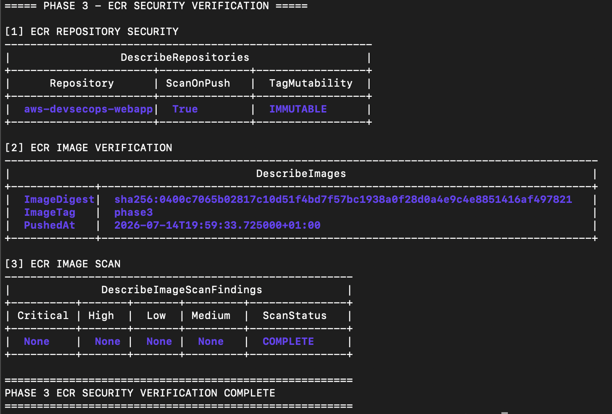

**Evidence file:** `docs/images/phase-3-ecr-security-outcome-verification.png`

---

## Verified Security Controls

| Security Check | Expected Result | Verified Result |
| --- | --- | --- |
| AWS Region | `eu-west-2` | Passed |
| ECR repository | Private repository exists | Passed |
| Repository name | `aws-devsecops-webapp` | Passed |
| Image scanning configuration | Scan on push enabled | Passed — `True` |
| Image tag mutability | Immutable | Passed — `IMMUTABLE` |
| AWS account configuration | Dynamically retrieved | Passed |
| ECR image URI | Dynamically configured | Passed |
| Docker ECR authentication | Authentication succeeds | Passed |
| Source container image | Verified Phase 2 image | Passed |
| Configured container user | Non-root `node` user | Passed |
| Image continuity | Same local image ID before ECR publication | Passed — `327e36a754cd` |
| ECR image tag | `phase3` exists | Passed |
| Image push | Image stored in Amazon ECR | Passed |
| Image digest | SHA-256 digest assigned | Passed |
| Image push timestamp | Recorded by Amazon ECR | Passed |
| ECR image scan | Scan process completed | Passed — `COMPLETE` |

---

## Phase 3 Security Evidence Summary

The Phase 3 evidence confirms that a secure private Amazon ECR repository was successfully established for the AWS DevSecOps Web App Protection project.

The repository is configured with image scanning on push enabled and immutable image tags.

Image scanning introduces vulnerability assessment into the container image publication workflow.

Image tag immutability prevents an existing published tag from being silently reassigned to a different container image.

The AWS account identifier and Amazon ECR image URI were dynamically derived from the authenticated AWS CLI environment rather than being permanently hard-coded into the project source.

Docker successfully authenticated with the Amazon ECR registry using an AWS-generated authentication password passed through standard input.

The secure container image created and validated during Phase 2 was selected as the source image for Amazon ECR publication.

The source image remained configured to use the non-root `node` user.

Local Docker image verification confirmed that the Phase 2 image and the ECR-tagged Phase 3 image referenced the same local image ID:

```text
327e36a754cd
```

This provides evidence of container image continuity between secure containerisation and registry publication.

The Phase 3 container image was successfully pushed to the `aws-devsecops-webapp` Amazon ECR repository.

Amazon ECR recorded the image tag, push timestamp, and SHA-256 digest for the published artifact.

The verified image digest is:

```text
sha256:0400c7065b02817c10d51f4bd7f57bc1938a0f28d0a4e9c4e8851416af497821
```

The SHA-256 digest provides a content-addressable identifier for the specific container image stored in Amazon ECR.

The Amazon ECR image scan reached the `COMPLETE` state, confirming that the configured image scanning process completed against the published Phase 3 image.

The scan completion status is documented separately from vulnerability severity assessment and does not make an unsupported claim that the image contains zero vulnerabilities.

Phase 3 therefore establishes a secured, traceable, and verifiable container image source for the AWS runtime deployment phases that follow.

---

## Phase 3 Security Outcome

Phase 3 established a secure AWS-managed private container registry for the web application.

The application container image now:

- Is stored in a private Amazon ECR repository.
- Uses an Amazon ECR repository with image scanning on push enabled.
- Uses immutable container image tags.
- Is derived from the secure container image validated during Phase 2.
- Preserves local image identity between Phase 2 validation and Phase 3 publication.
- Retains the non-root `node` container user configuration.
- Is authenticated and published using the Amazon ECR registry authentication workflow.
- Is identified by a SHA-256 image digest.
- Has an AWS-recorded image push timestamp.
- Has completed the configured Amazon ECR image scanning process.
- Provides a controlled container image source for later Amazon ECS and AWS Fargate deployment.

The private Amazon ECR repository now provides a controlled boundary between local container development and AWS runtime deployment.

Container image tag immutability reduces the risk of deployment artifact replacement.

SHA-256 image digest verification provides a specific content-addressable identifier for the published container image.

Image scanning on push introduces container vulnerability assessment into the image publication workflow.

Image continuity verification demonstrates that the container image published to Amazon ECR is the same local image artifact validated during Phase 2.

**Phase 3 is complete. The verified Amazon ECR container artifact is ready to be consumed by Amazon ECS and AWS Fargate during the AWS runtime deployment phase.**

---

## Next Phase - AWS ClickOps Runtime Deployment

The next phase will manually deploy the verified Amazon ECR container image into the AWS runtime environment.

The objective is to understand the AWS networking, load balancing, and container orchestration resources before rebuilding the infrastructure with Terraform.

The ClickOps deployment will introduce:

- Amazon VPC.
- Public subnets across multiple Availability Zones.
- Internet Gateway.
- Route tables.
- Application Load Balancer.
- ALB Target Group.
- Security Groups.
- Amazon ECS Cluster.
- AWS Fargate Task Definition.
- AWS Fargate Service.
- Route 53 DNS record.
- AWS Certificate Manager TLS certificate.

The expected application request flow will be:

```text
Client
  |
  v
Route 53
  |
  v
Application Load Balancer
  |
  v
Target Group
  |
  v
Amazon ECS Service
  |
  v
AWS Fargate Task
  |
  v
Web Application
```

The Application Load Balancer target group will use:

```text
/health
```

as the application health check endpoint.

The deployed application will be verified through the load balancer before AWS WAF is introduced.

Example verification:

```bash
curl https://security.<domain>/health
```

Expected response:

```json
{
  "status": "ok"
}
```

AWS WAF is **not enabled during the initial ClickOps runtime deployment**.

The manually created runtime infrastructure will be destroyed after verification and later rebuilt using Terraform.


---


# Phase 4 - AWS Runtime Deployment with ECS Fargate

The containerised web application is deployed into an AWS runtime environment using Amazon ECS with the AWS Fargate launch type.

The objective of this phase is to establish the AWS network and application runtime required to host the container behind an internet-facing Application Load Balancer.

The container image published to Amazon ECR during Phase 3 is used as the application deployment artifact.

AWS WAF is **not enabled during this phase**.

## Phase 4 Objectives

The objectives of this phase are to:

- Create a dedicated AWS application network.
- Deploy public subnets across multiple Availability Zones.
- Configure public internet routing.
- Create separate security groups for the Application Load Balancer and ECS workload.
- Deploy an internet-facing Application Load Balancer.
- Configure load balancer forwarding to application TCP port `8080`.
- Configure application health monitoring using `/health`.
- Deploy the Phase 3 container image using Amazon ECS and AWS Fargate.
- Verify the ECS service and Application Load Balancer target health.
- Verify the public application endpoints.
- Prevent direct unrestricted public access to ECS TCP port `8080`.

## Application Request Flow

```text
Client
  |
  v
Internet
  |
  v
Application Load Balancer
HTTP TCP 80
  |
  v
Target Group
HTTP TCP 8080
Health Check: /health
  |
  v
ECS Fargate Service
  |
  v
ECS Fargate Task
  |
  v
Node.js / Express Web Application
TCP 8080
```

The Application Load Balancer provides the public application entry point and forwards application traffic to the ECS Fargate task on TCP port `8080`.

The ECS application port is not directly exposed to unrestricted public traffic.

## AWS Resources

The following AWS resources are configured during this phase:

### Networking

- Dedicated VPC.
- Two public subnets.
- Internet Gateway.
- Public route table.
- Public route table associations.

### Application Load Balancer

- Internet-facing Application Load Balancer.
- Application Load Balancer security group.
- HTTP listener.
- Application target group.

### Amazon ECS

- ECS cluster.
- ECS Fargate task definition.
- ECS Fargate service.
- ECS task security group.
- ECS task execution role.

The Phase 3 Amazon ECR container image is used by the ECS task definition.

## Network Configuration

The dedicated application VPC uses the following CIDR range:

```text
10.40.0.0/16
```

Two public subnets are configured across separate Availability Zones:

| Availability Zone | Subnet CIDR | Public IP Mapping |
| --- | --- | --- |
| `eu-west-2a` | `10.40.1.0/24` | Enabled |
| `eu-west-2b` | `10.40.2.0/24` | Enabled |

An Internet Gateway is attached to the VPC.

The public route table contains the following internet route:

```text
0.0.0.0/0
```

Both public subnets are associated with the public route table.

## Network Security

Separate security groups are used for the Application Load Balancer and the ECS workload.

The network traffic path is:

```text
Internet
  |
  v
ALB Security Group
TCP 80
  |
  v
Application Load Balancer
  |
  v
ECS Security Group
TCP 8080
  |
  v
ECS Fargate Task
```

The Application Load Balancer accepts public HTTP traffic on TCP port `80`.

The ECS workload accepts application traffic on TCP port `8080` through the controlled load balancer path.

Direct unrestricted public ingress to ECS TCP port `8080` from `0.0.0.0/0` is not permitted.

This establishes a network trust boundary between the public Application Load Balancer and the ECS application workload.

## Application Load Balancer Configuration

The internet-facing Application Load Balancer uses the following listener configuration:

| Configuration | Value |
| --- | --- |
| Protocol | HTTP |
| Port | `80` |

The HTTP listener forwards traffic to the application target group.

The target group uses the following configuration:

| Configuration | Value |
| --- | --- |
| Protocol | HTTP |
| Port | `8080` |
| Target type | `ip` |
| Health check path | `/health` |

The `ip` target type supports ECS Fargate tasks using the `awsvpc` network mode.

## ECS Fargate Deployment

The application is deployed using an Amazon ECS service with the AWS Fargate launch type.

The ECS service uses the container image published to Amazon ECR during Phase 3.

The verified ECS service state is:

| ECS Service Check | Verified Result |
| --- | --- |
| Service | `aws-devsecops-service` |
| Status | `ACTIVE` |
| Launch type | `FARGATE` |
| Desired tasks | `1` |
| Running tasks | `1` |
| Pending tasks | `0` |

The ECS service reached a stable state with one desired task and one running task.

No application tasks remained pending.

## Phase 4 Evidence

Phase 4 security verification was performed against the AWS network and ECS runtime environment to confirm that the application operates correctly through the Application Load Balancer.

The verification demonstrates:

- The application VPC is available with CIDR `10.40.0.0/16`.
- Two public subnets are available across `eu-west-2a` and `eu-west-2b`.
- Public IP mapping is enabled for both public subnets.
- An Internet Gateway is attached to the application VPC.
- The public route `0.0.0.0/0` is active.
- The public route table is associated with both subnets.
- The Application Load Balancer listener accepts HTTP traffic on TCP port `80`.
- The target group forwards HTTP traffic to TCP port `8080`.
- The target group uses target type `ip`.
- The target group health check path is `/health`.
- The ECS service is active and uses the Fargate launch type.
- One desired ECS task is running with no pending tasks.
- The Application Load Balancer target is healthy.
- The `/health` endpoint returns `{"status":"ok"}`.
- The `/login` endpoint returns HTTP `200`.
- ECS TCP port `8080` is not directly exposed to unrestricted public traffic.
- The Phase 4 AWS runtime deployment security verification completed successfully.

### Phase 4 Network Security Verification

The following terminal evidence confirms the VPC, public subnet, Internet Gateway, public route, and route table association configuration.

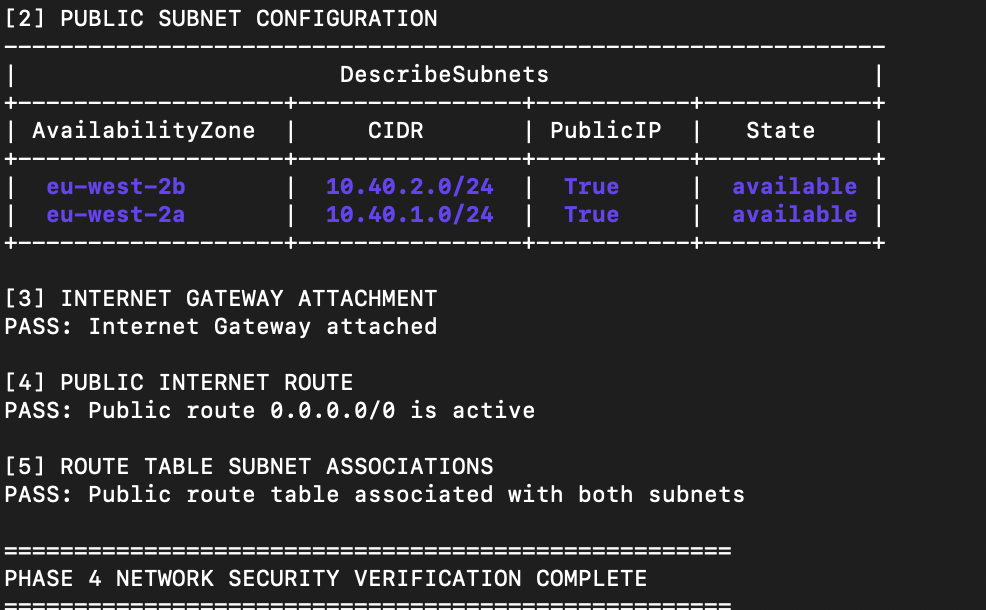

**Evidence file:** `docs/images/phase-4-network-security-verification.png`

### Phase 4 Security Outcome Verification

The following terminal evidence confirms the Application Load Balancer listener, target group configuration, ECS Fargate service state, Application Load Balancer target health, public application endpoints, and ECS runtime trust boundary.

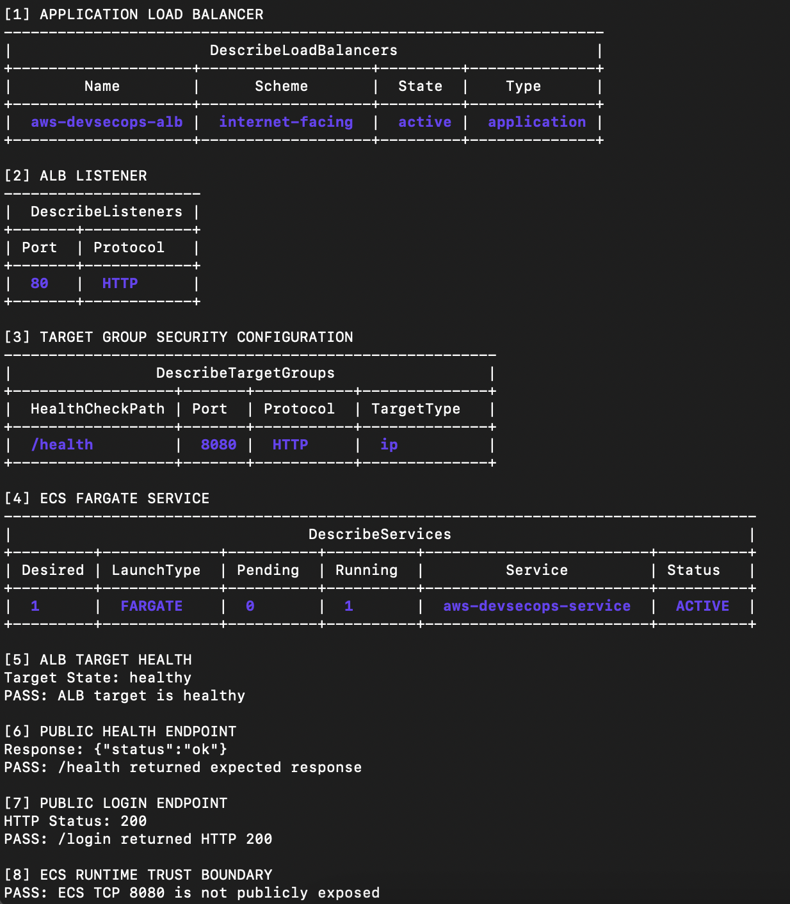

**Evidence file:** `docs/images/phase-4-security-outcome-verification.png`

### Verified Security Controls

| Security Check | Expected Result | Verified Result |
| --- | --- | --- |
| VPC state | Application VPC available | Passed |
| Public subnets | Two subnets available | Passed |
| Availability Zones | Subnets distributed across two Availability Zones | Passed |
| Internet Gateway | Attached to application VPC | Passed |
| Public route | `0.0.0.0/0` active | Passed |
| Route table associations | Both public subnets associated | Passed |
| ALB listener | HTTP TCP `80` | Passed |
| Target group port | HTTP TCP `8080` | Passed |
| Target type | `ip` | Passed |
| Health check path | `/health` | Passed |
| ECS launch type | `FARGATE` | Passed |
| ECS service state | `ACTIVE` | Passed |
| ECS desired tasks | `1` | Passed |
| ECS running tasks | `1` | Passed |
| ECS pending tasks | `0` | Passed |
| ALB target health | `healthy` | Passed |
| Health endpoint | `{"status":"ok"}` | Passed |
| Login endpoint | HTTP `200` | Passed |
| ECS public port exposure | TCP `8080` not exposed to `0.0.0.0/0` | Passed |

### Phase 4 Security Evidence Summary

The Phase 4 evidence confirms that the containerised application was successfully deployed into an AWS runtime environment using Amazon ECS and AWS Fargate.

The application network uses a dedicated VPC with two public subnets distributed across separate Availability Zones. An attached Internet Gateway and active public route provide the required internet connectivity for the public Application Load Balancer.

The Application Load Balancer accepts public HTTP traffic on TCP port `80` and forwards requests to the ECS application target group on TCP port `8080`.

The target group uses the `/health` endpoint to monitor application availability. The registered ECS target was verified as healthy, confirming that the Application Load Balancer can successfully communicate with the running application task.

The ECS service is active and stable with one desired task and one running task. No application tasks remain pending.

Application functionality was verified through the public Application Load Balancer endpoint. The `/health` endpoint returned the expected `{"status":"ok"}` response and the `/login` endpoint returned HTTP `200`.

Direct unrestricted public access to ECS TCP port `8080` is not permitted. Public application traffic is routed through the Application Load Balancer before reaching the ECS workload, establishing a controlled network trust boundary.

## Phase 4 Security Outcome

Phase 4 established a functional and security-verified AWS runtime environment for the containerised web application.

The application now:

- Runs within a dedicated AWS VPC.
- Uses two public subnets across separate Availability Zones.
- Uses an attached Internet Gateway and active public route.
- Runs as an ECS Fargate workload.
- Uses the container image published to Amazon ECR during Phase 3.
- Runs as an active and stable ECS service.
- Receives public traffic through an internet-facing Application Load Balancer.
- Uses an HTTP listener on TCP port `80`.
- Receives load-balanced application traffic on TCP port `8080`.
- Uses `/health` for Application Load Balancer target health checks.
- Registers as a healthy Application Load Balancer target.
- Exposes the `/health` and `/login` endpoints through the Application Load Balancer.
- Prevents direct unrestricted public access to ECS TCP port `8080`.
- Establishes a controlled load balancer-to-container network trust boundary.

The AWS runtime environment is now ready for the web application protection controls introduced in the next phase.

---


# Phase 5 - AWS WAF Protection

AWS WAF protects the Application Load Balancer.

A Web ACL is associated with the ALB.

## AWS Managed Rule Groups

The following AWS managed rules are enabled:

```text
AWSManagedRulesCommonRuleSet
AWSManagedRulesKnownBadInputsRuleSet
AWSManagedRulesSQLiRuleSet
```

Optional:

```text
AWSManagedRulesBotControlRuleSet
```

## Custom WAF Rules

### Missing User-Agent Rule

Requests without a `User-Agent` header are blocked.

```bash
curl -H "User-Agent:" \
  https://security.example.com/health
```

Expected:

```text
HTTP 403 Forbidden
```

### IP Rate Limiting

A rate-based rule limits excessive requests from a single source IP.

```bash
for i in $(seq 1 200); do
  curl -s -o /dev/null \
    -w "%{http_code}\n" \
    https://security.example.com/login
done
```

Requests should eventually return:

```text
403
```

### Geo Restriction

Requests from selected countries are blocked for demonstration purposes.

```hcl
blocked_country_codes = [
  "XX",
  "YY"
]
```

Country codes should be configured using Terraform variables.

---

# WAF Security Testing

## SQL Injection Test

```bash
curl -i \
  "https://security.example.com/login?username=%27%20OR%201%3D1%20--"
```

Expected response:

```text
HTTP/2 403
```

## XSS Test

```bash
curl -i \
  "https://security.example.com/login?test=%3Cscript%3Ealert%281%29%3C%2Fscript%3E"
```

Expected response:

```text
HTTP/2 403
```

## Known Bad Input Test

```bash
curl -i \
  "https://security.example.com/login?file=../../etc/passwd"
```

Expected response:

```text
HTTP/2 403
```

---

### Phase 5 AWS WAF Security Outcome Verification

The following terminal evidence confirms the AWS WAF Web ACL deployment, AWS managed protection rules, IP rate-based protection, Application Load Balancer association, legitimate application traffic handling, controlled known bad input blocking, and application health availability through AWS WAF.

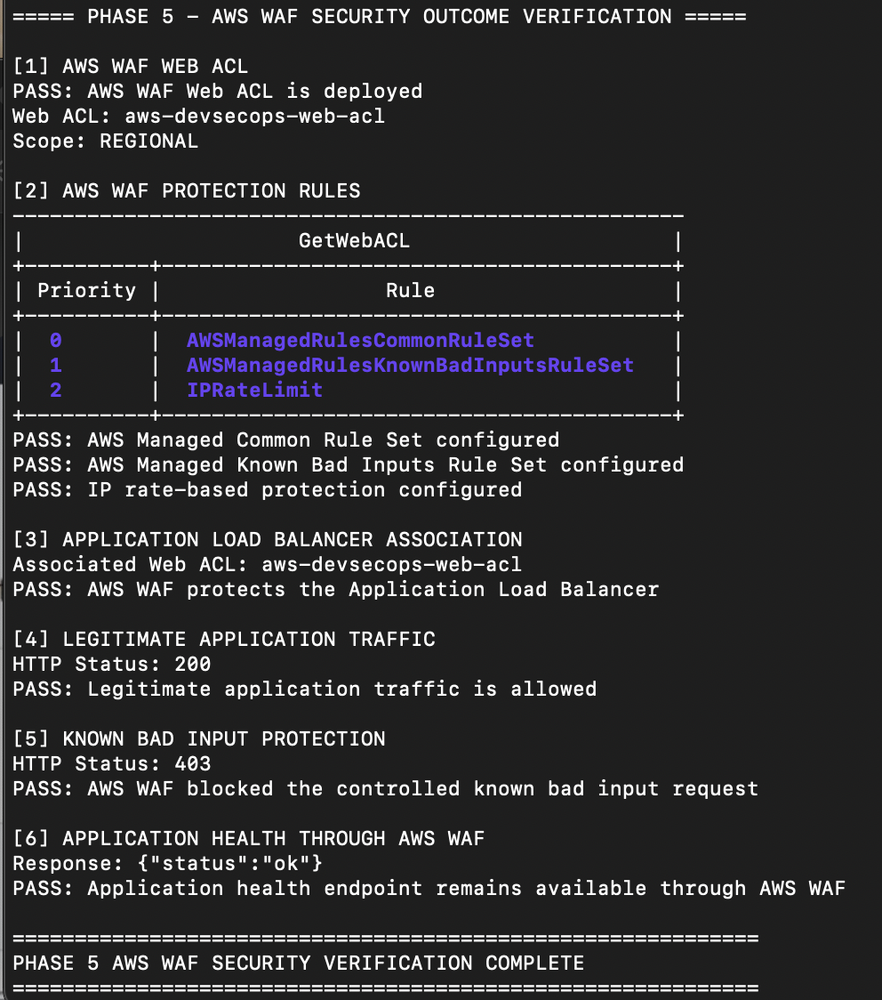


---

# WAF Rule Evidence

## WAF Rule Hit

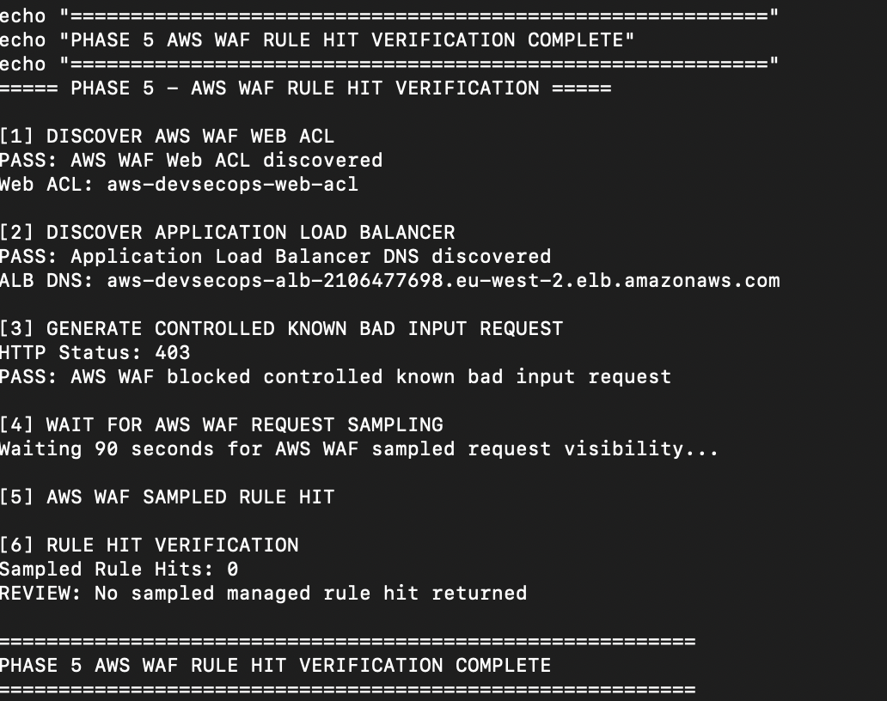

The screenshot demonstrates an AWS WAF rule matching a malicious request.

## Blocked Request

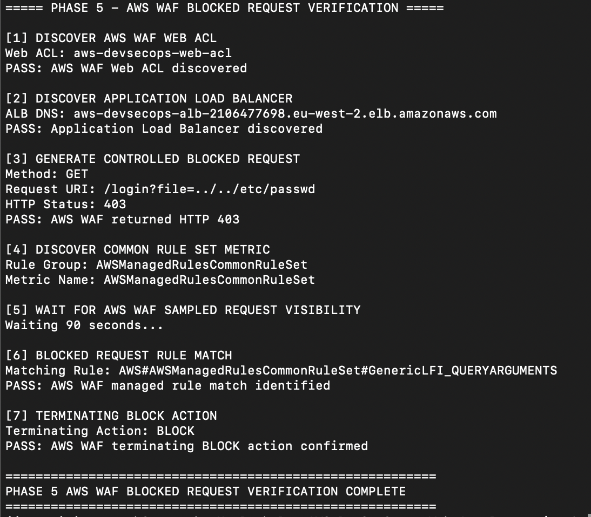

The blocked request should display the matching rule and terminating `BLOCK` action.

---

# Phase 6 - Logging and Monitoring

Security telemetry is enabled for the Application Load Balancer and AWS WAF.

## WAF Logging

Captured information includes:

- Request timestamp.
- Source IP address.
- HTTP method.
- URI.
- Request headers.
- Matching WAF rule.
- Web ACL action.
- Rate-based rule information.

## WAF Log Evidence


### AWS WAF CloudWatch Logging Configuration

AWS WAF logging is configured to deliver web request telemetry to a dedicated Amazon CloudWatch Logs log group.

The log group uses a seven-day retention period.

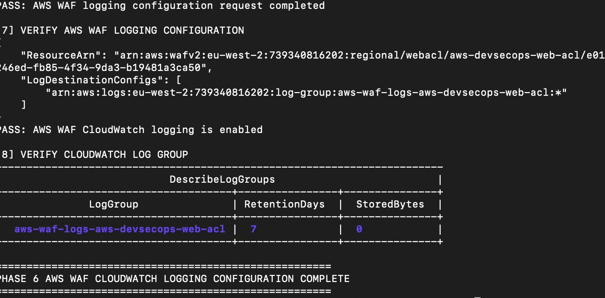


---

## ALB Access Logs

Application Load Balancer access logging is enabled.

Logs are delivered to an S3 bucket.


ALB logs provide visibility into:

- Client requests.
- HTTP response codes.
- Target response codes.
- Request processing times.
- User agents.
- Requested URLs.

### Application Load Balancer Access Logging

Application Load Balancer access logging is enabled and configured to deliver request telemetry to a dedicated Amazon S3 bucket.

The access log bucket uses Amazon S3 Block Public Access controls and AES-256 server-side encryption.

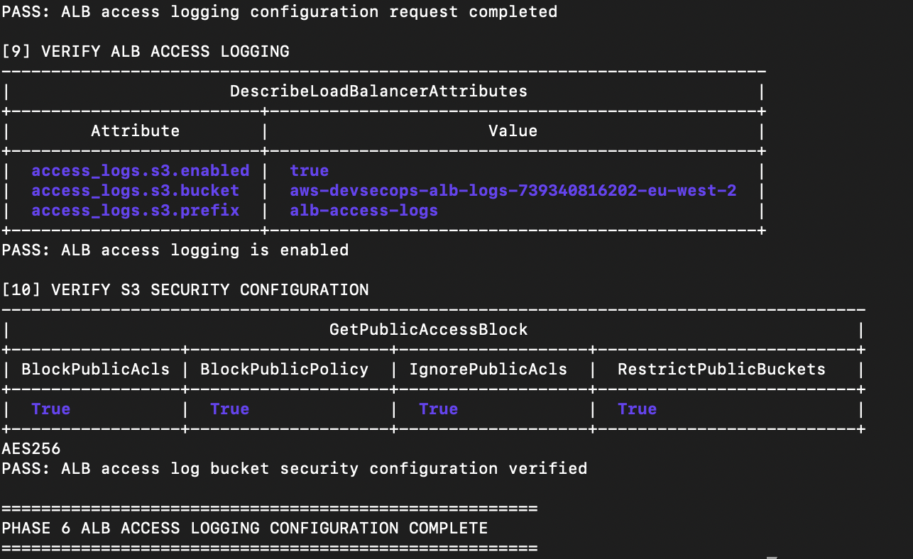


---

## CloudWatch Metrics

Important AWS WAF metrics include:

```text
AllowedRequests
BlockedRequests
CountedRequests
```

Metrics can be reviewed for the Web ACL and individual rules.

---

## AWS Shield

AWS Shield Standard provides baseline DDoS protection for supported AWS services.

AWS Shield Advanced can optionally be evaluated for environments requiring additional DDoS visibility and response capabilities.

Shield Advanced is optional due to additional cost considerations.

---

# Athena WAF Log Analysis

Amazon Athena can query security logs stored in Amazon S3.

Example security questions include:

- Which IP addresses generate the most blocked requests?
- Which WAF rules trigger most frequently?
- Which URIs receive malicious traffic?
- Which countries generate blocked traffic?
- What attack patterns occur most frequently?

Example query:

```sql
SELECT
    terminatingruleid,
    COUNT(*) AS blocked_requests
FROM waf_logs
WHERE action = 'BLOCK'
GROUP BY terminatingruleid
ORDER BY blocked_requests DESC;
```

---

# SNS Security Alerts

CloudWatch alarms can trigger Amazon SNS notifications.

Example alert conditions include:

- High number of blocked requests.
- Rate-limit rule triggered.
- Sudden SQL injection attempts.
- Significant increase in malicious traffic.

```text
AWS WAF
   |
   v
CloudWatch Metric
   |
   v
CloudWatch Alarm
   |
   v
Amazon SNS
   |
   v
Security Notification
```

---

# Phase 7 - CI/CD Security Gates

GitHub Actions provides the DevSecOps deployment pipeline.

```text
Security Scans
      |
      v
Container Build
      |
      v
Terraform Deploy
      |
      v
Post-Deploy Security Tests
```

A security failure stops the deployment pipeline.

---

## Stage 1 - Static Security Scans

### Trivy

Trivy scans the container image for vulnerabilities.

```bash
trivy image \
  --exit-code 1 \
  --severity HIGH,CRITICAL \
  webapp:latest
```

The pipeline fails when prohibited vulnerabilities are detected.

### Checkov

Checkov scans Terraform infrastructure.

```bash
checkov -d infra/
```

Checks include:

- Public resource exposure.
- Encryption configuration.
- IAM permissions.
- Logging configuration.
- Network security.
- AWS security best practices.

### Software Composition Analysis

Node.js:

```bash
npm audit
```

Python:

```bash
pip-audit
```

The selected scanner depends on the application runtime.

---

# Stage 2 - Build and Push

The container image is built after the security gates pass.

```text
Source Code
    |
    v
Docker Build
    |
    v
Trivy Scan
    |
    v
Amazon ECR
```

Images are tagged using the Git commit SHA.

Example:

```text
webapp:a1b2c3d
```

Immutable image tags improve deployment traceability.

---

# Stage 3 - Terraform Deployment

GitHub Actions authenticates with AWS using IAM OIDC.

Static AWS access keys are not stored in GitHub Secrets.

## Authentication Flow

```text
GitHub Actions
      |
      v
GitHub OIDC Token
      |
      v
AWS IAM Trust Policy
      |
      v
Assume IAM Role
      |
      v
Temporary AWS Credentials
```

The pipeline executes:

```bash
terraform init
terraform fmt -check
terraform validate
terraform plan
terraform apply -auto-approve
```

---

# Stage 4 - Post-Deployment Security Tests

Automated security tests verify that AWS WAF actively blocks malicious requests.

## XSS Test

```bash
curl -s -o /dev/null \
  -w "%{http_code}" \
  "https://security.example.com/login?test=%3Cscript%3Ealert%281%29%3C%2Fscript%3E"
```

Expected:

```text
403
```

## SQL Injection Test

```bash
curl -s -o /dev/null \
  -w "%{http_code}" \
  "https://security.example.com/login?username=%27%20OR%201%3D1%20--"
```

Expected:

```text
403
```

## Pipeline Failure Logic

```bash
STATUS_CODE=$(curl -s -o /dev/null \
  -w "%{http_code}" \
  "https://security.example.com/login?test=%3Cscript%3Ealert%281%29%3C%2Fscript%3E")

if [ "$STATUS_CODE" = "200" ]; then
  echo "Security test failed: malicious request was allowed"
  exit 1
fi

echo "Security test passed: request blocked with HTTP $STATUS_CODE"
```

If AWS WAF allows the malicious request, the pipeline fails.

---

# CI/CD Security Evidence


Evidence should demonstrate:

- Trivy scan passing.
- Checkov scan passing.
- Dependency scan passing.
- Container image pushed to ECR.
- Terraform deployment succeeding.
- Post-deployment WAF tests returning HTTP `403`.

---

# Security Controls Implemented

| Threat | Security Control |
| --- | --- |
| SQL Injection | AWS Managed SQLi Rules |
| Cross-Site Scripting | AWS Common Rule Set |
| Known Malicious Inputs | Known Bad Inputs Rules |
| Automated Bots | AWS Bot Control |
| Brute Force | WAF Rate-Based Rules |
| Request Flooding | WAF Rate Limiting |
| DDoS | AWS Shield |
| Geographic Restrictions | WAF Geo Match |
| Anonymous Scripts | User-Agent Validation |
| Vulnerable Containers | Trivy |
| Insecure Terraform | Checkov |
| Vulnerable Dependencies | SCA |
| Static AWS Credentials | IAM OIDC |
| Security Regression | Post-Deploy WAF Tests |
| Traffic Investigation | ALB and WAF Logs |

---

# Security Design Decisions

## WAF Before the Application

Malicious traffic is blocked before reaching ECS tasks.

This reduces unnecessary application processing and limits exposure of the application runtime.

## No Static AWS Credentials

GitHub Actions uses AWS IAM OIDC and short-lived credentials.

Long-lived AWS access keys are not stored in the CI/CD platform.

## Immutable Container Tags

Container images use Git commit SHA tags.

This creates a direct relationship between source code and deployed artifacts.

## Security Gates Before Deployment

Security scans execute before infrastructure deployment.

A failed security control prevents the pipeline from progressing.

## Security Validation After Deployment

Successful infrastructure deployment does not automatically mean the security configuration is correct.

Post-deployment tests verify that AWS WAF actively blocks malicious request patterns.

---

# Threat Model

The project focuses on internet-originated threats against a public web application.

## Protected Assets

- Web application.
- ECS workloads.
- Application endpoints.
- AWS infrastructure.
- Deployment pipeline.
- Security logs.

## Threat Actors

- Automated scanners.
- Malicious bots.
- Opportunistic attackers.
- Brute-force tools.
- Web vulnerability scanners.

## Example Threats

```text
SQL Injection
Cross-Site Scripting
Path Traversal
Known Malicious Inputs
Bot Traffic
Brute Force
HTTP Request Flooding
DDoS
CI/CD Credential Exposure
Infrastructure Misconfiguration
```

---

# Verification Checklist

## Application

- [ ] `/health` returns HTTP 200.
- [ ] `/login` is reachable.
- [ ] Application listens on the configured port.

## Container

- [ ] Multi-stage build implemented.
- [ ] Container runs as non-root.
- [ ] Minimal runtime image used.
- [ ] Health check configured.
- [ ] Container scan passes.

## AWS Infrastructure

- [ ] VPC deployed.
- [ ] ALB deployed.
- [ ] ECS Fargate service healthy.
- [ ] HTTPS enabled.
- [ ] Route 53 record configured.
- [ ] ACM certificate validated.

## AWS WAF

- [ ] Web ACL associated with ALB.
- [ ] Common Rule Set enabled.
- [ ] Known Bad Inputs enabled.
- [ ] SQLi Rule Set enabled.
- [ ] Missing User-Agent rule enabled.
- [ ] Rate limiting enabled.
- [ ] Geo restriction enabled.

## Logging

- [ ] WAF logging enabled.
- [ ] ALB access logging enabled.
- [ ] CloudWatch metrics enabled.
- [ ] Security logs stored centrally.

## CI/CD

- [ ] Trivy scan configured.
- [ ] Checkov scan configured.
- [ ] Dependency scan configured.
- [ ] AWS OIDC authentication configured.
- [ ] Container pushed to ECR.
- [ ] Terraform deployment automated.
- [ ] Post-deployment security tests configured.

---

# Screenshots and Project Evidence

| Evidence | Image |
| --- | --- |
| AWS WAF rule hit | `docs/images/waf-rule-hit.png` |
| Blocked malicious request | `docs/images/waf-blocked-request.png` |
| ALB access logs | `docs/images/alb-access-logs.png` |
| AWS WAF logs | `docs/images/waf-logs.png` |
| CI/CD security gates | `docs/images/cicd-security-gates.png` |

> Screenshots must not expose AWS account IDs, credentials, tokens, or other sensitive values.

---

# Cost Considerations

This project deploys billable AWS resources.

Potential costs include:

- Application Load Balancer.
- ECS Fargate tasks.
- NAT Gateway if added.
- AWS WAF Web ACL and rule evaluations.
- AWS WAF Bot Control.
- S3 log storage.
- CloudWatch logs and metrics.
- Route 53 hosted zones.
- Athena queries.
- AWS Shield Advanced if enabled.

Destroy resources when testing is complete.

```bash
cd infra
terraform destroy
```

Review the AWS account after destruction to confirm billable resources have been removed.

---

# Key Learning Outcomes

By completing this project, you will demonstrate practical experience with:

- AWS application security.
- AWS WAF architecture.
- OWASP web attack mitigation.
- Container security.
- ECS Fargate.
- Application Load Balancers.
- Infrastructure as Code.
- Terraform.
- GitHub Actions.
- AWS IAM OIDC.
- DevSecOps security gates.
- Container vulnerability scanning.
- IaC security scanning.
- Security logging.
- Cloud security monitoring.
- Automated security validation.

---

# Future Improvements

Potential improvements include:

- AWS Firewall Manager.
- AWS Security Hub integration.
- Amazon GuardDuty.
- AWS Config rules.
- Security Lake integration.
- SIEM log forwarding.
- Automated IP reputation lists.
- WAF CAPTCHA challenges.
- WAF Challenge actions.
- Custom bot detection.
- Canary security testing.
- OWASP ZAP integration.
- Signed container images.
- SBOM generation.
- SLSA build provenance.
- Terraform policy enforcement using OPA or Conftest.

---

# Disclaimer

This project is designed for educational and authorised security testing purposes.

Security tests should only be executed against infrastructure that you own or have explicit permission to test.

The WAF rules and security thresholds used in this project are demonstration configurations and should be reviewed, tuned, and tested before use in production environments.

---

## Project Status

```text
Application             [ ]
Secure Container        [ ]
ClickOps Deployment     [ ]
Terraform Deployment    [ ]
AWS WAF                 [ ]
Security Logging        [ ]
CI/CD Security Gates    [ ]
Post-Deploy Testing     [ ]
Documentation           [ ]
```

---

**Repository:** `aws-devsecops-webapp-protection`
